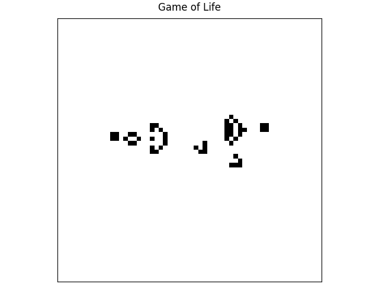

<!--
This README template is designed with dual purpose.

It should help you think about and plan various aspects of your
exemplar. In this regard, the document need not be completed in
a single pass. Some sections will be relatively straightforward
to complete, others may evolve over time.

Once complete, this README will serve as the landing page for
your exemplar, providing learners with an outline of what they
can expect should they engage with the work.

Recall that you are developing a software project and learning
resource at the same time. It is important to keep this in mind
throughout the development and plan accordingly.
-->


<!-- Your exemplar title. Make it sound catchy! -->
# Research Python Patterns: Solving common pain points in research software development

<!-- A brief description of your exemplar, which may include an image -->
This exemplar explores software design patterns, tools, and Python packages that make code development easier and more maintainable. Since not all design patterns translate well to a research context, the focus here is on patterns that are practical and beneficial for research workflows, including concepts such as coupling and cohesion, dependency injection, linting, and Model-View-Controller (MVC) architecture. To demonstrate these concepts in action, we use [Conway's Game of Life](https://en.wikipedia.org/wiki/Conway's_Game_of_Life) as our working example, a well-defined yet rich problem.

The Game of Life is a simulation of an array of pixels which can be "alive" or "dead". Each generation, the state of the pixel is determined by the state of pixels around it in the previous generation. This leads to a complex and interesting system from a simple set of rules.
This is a gif of the [Gosper glider gun](https://conwaylife.com/wiki/Gosper_glider_gun) pattern which creates cells that glide across the screen.


<!-- Author information -->
This exemplar was developed at Imperial College London by [Hui Ling Wong](https://profiles.imperial.ac.uk/hui.wong16) in
collaboration with [Alex Dewar](https://profiles.imperial.ac.uk/a.dewar) from Research Software Engineering and
[Chris Cooling](https://profiles.imperial.ac.uk/c.cooling10) from Research Computing & Data Science at the Early Career
Researcher Institute.


<!-- Learning Outcomes.
Aim for 3 - 4 points that illustrate what knowledge and
skills will be gained by studying your ReCoDE exemplar. -->
## Learning Outcomes 🎓

Software development comes with common pain points. After completing this exemplar, students will:

- Understand how linters can catch and prevent common code quality issues.
- Understand the pain points that design patterns solve and how to apply them in a research context.
- Understand why unvalidated user input can cause problems and how packages such as [`pydantic`](https://pydantic.dev/docs/validation/latest/get-started/) and [`typer`](https://typer.tiangolo.com/) can help, with an introduction to dependency injection and type checking.
- Understand how type hinting in Python reduces ambiguity and makes code easier to maintain.
- Understand how tooling such as [`pre-commit`](https://pre-commit.com/) and type checkers can catch errors before they become problems.
- Understand how to build a Python command line tool to make your code more accessible and reusable.


<!-- Audience. Think broadly as to who will benefit. -->
## Target Audience 🎯

Anyone working with Python.


<!-- Requirements.
What skills and knowledge will students need before starting?
e.g. ECRI courses, knowledge of a programming language or library...

Is it a prerequisite skill or learning outcome?
e.g. If your project uses a niche library, you could either set it as a
requirement or make it a learning outcome above. If a learning outcome,
you must include a relevant section that helps with learning this library.
-->
## Prerequisites ✅

### Academic 📚

- Foundational understanding of the Python programming language
- Familiarity with installing software and packages.

### System 💻

- Ability to install new software on the machine


<!-- Quick Start Guide. Tell learners how to engage with the exemplar. -->
## Getting Started 🚀

e.g. Step-by-step guide:

1. Start by (instruction).
2. Visit the sections of this notebook in some particular order.
3. Attempt exercises `1a`, `1b`, etc.
4. Progress to advanced materials in the Github repository linked here.
5. Compare with solutions available in the `solutions` folder.


<!-- Background. Tell learners about why this exemplar is useful. -->
## Disciplinary Background 🔬

One of the most common challenges in research software development is knowing how to structure code in a way that is maintainable, readable, and reusable. After all, the most frequent user of your own code is yourself, and past you and future you need to be able to communicate clearly through it. Alongside this, there is a wealth of tooling available that can make developing research software significantly easier, yet much of it remains unknown to most researchers. This exemplar was born out of the pain points encountered first-hand when writing research software, and aims to address those challenges in a practical and accessible way. As these are fundamentally generic software development issues, this exemplar is relevant and useful across all research disciplines.


<!-- Software. What languages, libraries, software you use. -->
## Software Tools 🛠️

Programming language: Python

Tools:
1. [`uv`](https://docs.astral.sh/uv/#highlights) - for package and environment management
2. [`ruff`](https://docs.astral.sh/ruff/) - for linting and formatting
3. [`prek`](https://prek.j178.dev/) or [`pre-commit`](https://pre-commit.com/) - for git hook script to check code quality before committing to git
4. [`ty`](https://docs.astral.sh/ty/) or [`pyright`](https://github.com/microsoft/pyright) - for Python static type checking

<!--This renders magically as a code snippet on GitHub-->
Libraries:
1. `numpy` for working with arrays
2. `pytest` for testing code
3. `matplotlib` for creating plots
4. `pydantic` for handling input from users
5. `pyyaml` for loading configuration files from [yaml file format](https://yaml.org/)
6. `typer` for building a command line tool

All dependencies for this project can be found in the [`pyproject.toml`](https://github.com/ImperialCollegeLondon/ReCoDE-research-python-patterns/blob/main/pyproject.toml) file

<!-- Repository structure. Explain how your code is structured. -->
## Project Structure 🗂️

<!--Initially generated using `tree --gitignore` and shortened for brevity-->

```
.
├── LICENSE.md
├── README.md
├── docs
│   ├── assets
│   │   ├── favicon.ico
│   │   ├── ...
│   │   └── gosper-glider-gun.gif
│   ├── content.md
│   └── index.md
├── mkdocs.yml
├── pyproject.toml
├── ruff.toml
├── src/game_of_life
│   ├── __init__.py
│   ├── main.py
│   ├── ...
│   └── view
├── tests
│   ├── __init__.py
│   ├── ...
│   └── test_view.py
└── uv.lock
```

Code is organised into logical components:

- `docs` for documentation
  - `assets` for static files like images that are used in the documentation
- `src` for core code, potentially divided into further modules
- `test` for testing scripts


<!-- Best practice notes. -->
## Best Practice Notes 📝

- Code testing and/or test examples with `pytest` and docstring tests
- Use of continuous integration
- Use of [conventional commits](https://www.conventionalcommits.org/en/v1.0.0/) for commit messages
- Use of design patterns, dependency injection, static type checking, linting and pre-commit

<!-- Estimate the time it will take for a learner to progress through the exemplar. -->
## Estimated Time ⏳

TO BE UPDATED ONCE THIS IS FINISHED!!!

| Task       | Time    |
| ---------- | ------- |
| Reading    | 3 hours |
| Practising | 3 hours |


<!-- Any references, or other resources. -->
## Additional Resources 🔗

- Book: [Conway's Game of Life - Mathematics and Construction](https://conwaylife.com/book/) by Nathaniel Johnston and Dave Greene. DOI: [10.5281/zenodo.6097284](https://doi.org/10.5281/zenodo.6097284)
- Webpage: [Game of Life Patterns](https://conwaylife.com/book/#rle_files)

<!-- LICENCE.
Imperial prefers BSD-3. Please update the LICENSE.md file with the current year.
-->
## Licence 📄

This project is licensed under the [BSD-3-Clause license](LICENSE.md).
