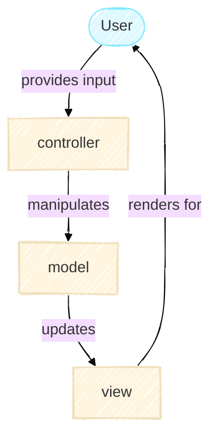

# Model-View-Controller Architecture

**Estimated read time:** 10 minutes

The Model-View-Controller (MVC) architecture is a widely used way to organize code. You'll find it in web applications, desktop software and mobile apps. It's a well-established pattern because it has proven its effectiveness and it separates concerns so different parts of your code can be understood, modified, and extended independently.

This principle is just as valuable in research software. When you write code to solve a real problem, whether simulating Conway's Game of Life or analyzing experimental data, you quickly run into a challenge: different parts of your code are responsible for fundamentally different things. Your simulation logic shouldn't know or care whether results are being printed to a terminal, saved to a file, or displayed as an interactive plot. Equally, your user interface shouldn't need to understand the underlying mathematical rules. Yet, these pieces must still communicate and work together.

MVC is a time-tested way to strike that balance. It's not a rigid rulebook. Instead, it's a principle for thinking about how to structure larger projects, keeping the simulation, display, and user interaction cleanly separated while remaining well-coordinated. This page walks through MVC at a high level, focusing on why it matters for research software. Later tutorials dive into how each part works in practice.

## The Three Pieces



### Model

The Model is where the core logic lives. In any MVC application, it holds the data and the rules for how that data changes. In a web app, it might be your database and business logic. In research software, it's where your science lives, the algorithms, equations, simulations, or analyses that are the substance of your work. In this project, the class `GameOfLife` in [`model.py`](https://github.com/ImperialCollegeLondon/ReCoDE-research-python-patterns/blob/main/src/game_of_life/model.py) is the Model which implements the rules for Conway's Game of Life.

What makes the Model crucial for research is that it must be *independent*. Independence here means that doesn't depend on how a user asked it to run or how results will be displayed. This means that someone should be able to run your Model in their own pipeline, test it against your published results, modify it to ask different questions, or integrate it into a larger analysis, all without struggling with display code or interface details tangled into the science. That's the difference between research code that can be reused and code that's locked into one specific context.

The beauty of this is that your research code can now serve multiple purposes. The first as a tool which runs the pipeline that you need to perform your analysis. This would have all three components of the MVC architecture. In this project, when a researcher runs in their terminal `game-of-life cli basic-config.yaml`, it runs the simulation with specific parameters and down the code paths you have defined. This is convenient for end users who want to explore with different inputs and reproduce experiments.

The second purpose is as a library which other people could use. In this project, everything in the `model.py` file could be a separate library for others to use for their own analysis, without being restricted to the rest of the program flow. A researcher who wants to build on this work would import the Model directly:

```python
from game_of_life.model import GameOfLife

game = GameOfLife(n_rows=50, n_cols=50)
for generation in range(100):
    game.step()
    # Analyze the state, integrate with other code, etc.
```

The Model shouldn't make assumptions about how it will be used and should present a clean interface. Whether that interface is called from a CLI, a Jupyter notebook, another group's analysis pipeline, or a test suite, the Model should work in the same way. That flexibility is what enables your work to be built upon.

### View

The View is how you communicate results. It reads from the Model and transforms the data into something others can understand. For example, it could be a figure for a paper, a table for a report, or an interactive visualization for exploration. In this project, you can display the grid in the terminal as ASCII art, or save it as an image with `matplotlib`. Those are two different Views. Neither View changes the Model.

For research software, the scientific truth lives in the Model with the View as just the presentation.
Someone reading your paper should trust the results because they can independently verify the Model, not because the visualization looks convincing.

### Controller

The Controller is the middleman. It receives input from outside (a person typing a command, clicking a button, writing a Python script). It figures out what that input means, tells the Model to do something, and asks the View to update. It's the coordinator.

### The Flow in Practice

When someone runs the application via the command line, here's the high-level sequence:

1. *Input*: User provides commands and arguments from the terminal.
2. *Controller Interprets*: The Controller parses the user input and creates the necessary Model and View instances.
3. *Model Works*: The Controller tells the Model how to evolve, step by step.
4. *View Updates*: After each step, the View reads the Model's current state and displays it.
5. *Output*: The user sees the result.

The salient feature in this is that each part stays independent. The Model doesn't know about the View, the View doesn't direct the Model. The Controller connects them but doesn't do the actual work.

## Why Separate Them? And what makes it possible?

Imagine your research code wasn't structured this way. Your simulation logic would be tangled with visualization code. Your analysis would be mixed with the interface for running it. This creates problems in any context. It's harder to understand, harder to test, harder to reuse. But in research, the consequences are particularly serious.

When a collaborator wants to use your Model in a different context, such as a different visualization, a different interface, or integrated into their pipeline. They'd have to untangle everything and hope they don't break the science. When you need to verify your own results, you'd have to worry about whether a bug is in your analysis or in the display code. For reproducibility efforts, the tangle makes it nearly impossible to isolate what your research actually does.

This is the problem of tight coupling - when different parts of your code depend heavily on each other, changes in one place ripple everywhere. Poor readability compounds this. When concerns are mixed together, it becomes difficult to follow the logic, spot errors, or onboard collaborators. In general software engineering, tight coupling and low cohesion are well-known obstacles to maintainable, extensible code. In research, they directly undermine reproducibility and reuse. MVC reduces coupling by drawing clear boundaries: the Model is independent; Views and interfaces are interchangeable. When the science is separated from display and interface, anyone can verify, modify, or repurpose your core logic.

At the same time, each piece needs high cohesion - everything inside it should serve a single purpose. This makes code easier to reason about, but it's especially important in research. The Model focuses on the science. Views focus on presentation. The Controller focuses on orchestration. When these are cleanly separated, a collaborator, a reviewer, or your future self can understand what the code does without being distracted by peripheral concerns. You can say with confidence: "Here is exactly what my research does" by pointing to the Model.

The interplay between low coupling and high cohesion is a cornerstone of good software design, and it connects directly to a broader set of principles known as [SOLID](https://en.wikipedia.org/wiki/SOLID). These five principles, originally formulated for object-oriented design, provide a framework for writing code that is easy to understand, extend, and maintain. Two are particularly relevant here:

1. *Single Responsibility Principle*: each component should have only one responsibility. This maps directly onto cohesion
2. *Open/Closed Principle*: code should be open for extension but closed for modification. This captures exactly what MVC enables. You can add new Views or interfaces without touching the core Model.

These principles also matter the moment you start writing tests. A well-structured unit test checks one thing in isolation. However, that's only possible if the code itself has a single, clear responsibility. If your simulation logic is tangled with your display code, there's no clean way to test the science without also invoking the interface. The test becomes complicated, fragile, and hard to interpret. This is a strong signal that something needs to be separated.

One approach that complements this approach is [Test-Driven Development (TDD)](https://en.wikipedia.org/wiki/Test-driven_development). This is the practice of writing your test before you write the code. This might sound counterintuitive at first, but it's a powerful tool. If you find it difficult to write a simple, focused test for a piece of code, that difficulty is telling you something: the code is probably doing too much. TDD naturally steers you towards the Single Responsibility Principle, because code that is hard to test in isolation is code that needs to be broken up. For researchers, this is particularly valuable, if your Model is cleanly separated and well-tested, you can be confident that your results reflect your science, not an accidental interaction between unrelated parts of your code.

Finally, [polymorphism](https://www.baeldung.com/cs/polymorphism) is what enables the MVC architecture to work. The Controller doesn't need to know which View it's talking to. There's an abstract interface which captures "what methods must a View have?". Thus, as long as something implements that interface, the Controller works without changes. This is useful in any application. If a colleague wants a new visualization, they can implement a new View interface, leaving the Model untouched. If someone wants to run your Model in their own analysis pipeline, they can import the Model directly without using the CLI or Views. With your Model living independently of how it's used, extensions don't risk breaking the core science.

## MVC Is the Architecture, Not the Whole Story

MVC describes how the big pieces fit together. It's a generic pattern used in countless applications. But within each piece, you can use other techniques and patterns to handle specific challenges unique to your domain or problem.

For example, in a research Model, you might use strategies for initializing data differently (zeros, random, specific patterns). In the Controller, you might use [factories](https://en.wikipedia.org/wiki/Factory_method_pattern) to decide which strategy to create based on configuration. In the View, you might use [abstract base classes](https://docs.python.org/3/glossary.html#term-abstract-base-class) to define what any View must implement.

!!! abstract "TL;DR"
    These patterns are details. MVC is the skeleton.

## Bringing It Together

MVC is useful in any software project because it provides clear boundaries and reduces dependencies. But in research software, these benefits become essential. Separation of concerns is not just cleaner design; it directly enables reproducibility, re-usability, and collaboration.

When different parts of your code focus on different things (e.g. science, presentation, or interface) they become easier to understand independently, easier to test rigorously, and easier for others to reuse or extend. A collaborator shouldn't have to understand your visualization code to use your Model. A code reviewer shouldn't have to trace through interface logic to verify your science. And future researchers building on your work should be able to extract your Model and repurpose it without the overhead of display code.

The following pages go deeper into each part: how the Model is structured for clarity, how Views work together through abstraction, and how the Controller coordinates everything while staying independent of the science. Each page shows not just what the code does, but *why* it's organized that way.
