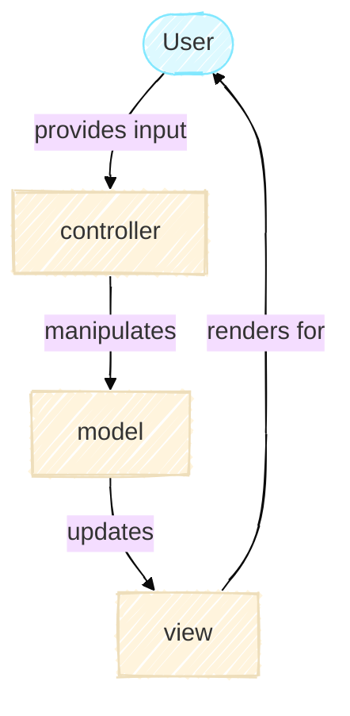

# Model-View-Controller Architecture

The Model-View-Controller (MVC) architecture is a widely used ways to organize code. You'll find it in web applications, desktop software and mobile apps. It's a well-established pattern because it has proven its effectiveness,  it separates concerns so different parts of your code can be understood, modified, and extended independently.

This principle is just as valuable in research software. When you write code to solve a real problem, whether simulating Conway's Game of Life or analyzing experimental data, you quickly run into a challenge: different parts of your code are responsible for fundamentally different things. Your simulation logic shouldn't know or care whether results are being printed to a terminal, saved to a file, or displayed as an interactive plot. Equally, your user interface shouldn't need to understand the underlying mathematical rules. Yet, these pieces must still communicate and work together.

MVC is a time-tested way to strike that balance. It's not a rigid rulebook. Instead, it's a principle for thinking about how to structure larger projects, keeping the simulation, display, and user interaction cleanly separated while remaining well-coordinated. This page walks through MVC at a high level, focusing on why it matters for research software. Later tutorials dive into how each part works in practice.

## The Three Pieces



### Model

The Model is where the core logic lives. In any MVC application, it holds the data and the rules for how that data changes. In a web app, it might be your database and business logic. In research software, it's where your science lives, the algorithms, equations, simulations, or analyses that are the substance of your work. In this project, class `GameOfLife` in [`model.py`](https://github.com/ImperialCollegeLondon/ReCoDE-research-python-patterns/blob/main/src/game_of_life/model.py) is the model which implements the rules for Conway's Game of Life.

!!! tip
    What makes the model crucial for research is that it must be *independent*.

Independence here means that doesn't depend on how a user asked it to run or how results will be displayed. This means that someone should be able to run your model in their own pipeline, test it against your published results, modify it to ask different questions, or integrate it into a larger analysis, all without struggling with display code or interface details tangled into the science. That's the difference between research code that can be reused and code that's locked into one specific context.

The beauty of this is that your research code can now serve multiple purposes. The first as a tool which runs the pipeline that you need to perform your analysis. This would have all three components of the MVC architecture. In this project, a researcher which runs in their terminal `game-of-life cli basic-config.yaml` it runs the simulation with specific parameters and down the code paths you have defined.
This is convenient for end users who want to explore with different inputs and reproduce experiments.

The second purpose is as a library which other people could use. In this project, everything in the `model.py` file could be a separate library that your users can use to for their own analysis and aren't restricted to the flow of the program specified in your pipeline. In this project, a researcher who wants to build on your work imports the model directly:

```python
from game_of_life.model import GameOfLife

game = GameOfLife(n_rows=50, n_cols=50)
for generation in range(100):
    game.step()
    # Analyze the state, integrate with other code, etc.
```

As your model doesn't assume how it will be used, it exposes a clean interface. Whether that interface is called from a CLI, a Jupyter notebook, another group's analysis pipeline, or a test suite, the model works the same way. That flexibility is what enables your work to be built upon.

### View

The View is how you communicate results. It reads from the model and transforms the data into something others can understand. For example, it could be a figure for a paper, a table for a report, or an interactive visualization for exploration. In this project, you can display the grid in the terminal as ASCII art, or save it as an image with `matplotlib`. Those are two different views. Neither view changes the model.

For research software, the scientific truth lives in the model with the view as just the presentation.
Someone reading your paper should trust the results because they can independently verify the model, not because the visualization looks convincing.

### Controller

The Controller is the middleman. It receives input from outside (a person typing a command, clicking a button, writing a Python script). It figures out what that input means, tells the model to do something, and asks the view to update. It's the coordinator.
