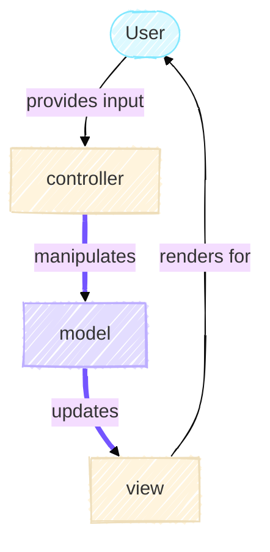

# The Model

<!-- TODO: ADD IN link to MVC article overview  -->
The Model is the centerpiece of the Game of Life simulation.
It's responsible for maintaining the game state and computing how that state evolves over time. In the Model-View-Controller (MVC) architecture, the Model knows nothing about how it's being displayed or which buttons the user is clicking. It only understands one thing - the rules of Conway's Game of Life and how to apply them.

## Understanding Conway's Game of Life

Conway's Game of Life is a cellular automaton where cells on a grid live or die based on simple rules. These rules are beautifully elegant:

1. A live cell with 2 or 3 live neighbors survives to the next generation
2. A dead cell with exactly 3 live neighbors becomes alive
3. All other cells die or stay dead

That's it. From these three rules, complex and often unpredictable patterns emerge. Some configurations oscillate endlessly. Others move across the grid like spaceships. Still others produce intricate structures that change in fascinating ways.

### From Rules to Code: The Single Responsibility Principle

When we translate these rules into code, we face an interesting design decision. We could write one large method that computes the next generation and updates the grid. But notice that Conway's rules describe two distinct concerns,

1. Computing what the next generation should be
2. Advancing the simulation

As such, our implementation splits these concerns into two methods. The `GameOfLife` class provides `compute_next_generation()` and `step()`.
This split follows the Single Responsibility Principle. The former applies Conway's rules. The latter coordinates the simulation's progression and maintain the history. Separating these makes the code easier to test. For example, the computation of the next generation can be tested independently of the stepping.

```python title="model.py in GameOfLife class"
    def compute_next_generation(self) -> NDArrayU8:

```

This method computes the next generation by first determining how many neighbours are alive. Using the `np.roll` function we can shift the grid to get a neighboring value at the current index. By adding up all neighbours, we can determine how many neighbours are alive. The next steps involve applying the rules of the game and handling the boundary. These two steps result in an array of what the grid will look like at the next step. Thus, this method has only one responsibility.

```python title="model.py in GameOfLife class"
    def step(self) -> None:
        self._generation += 1
        self._grid = self.compute_next_generation()
        self._history.append(self._grid)
```

This method is responsible for coordinating all the different components involved in moving from one time step to the next. It is also the means for controller to manipulate the model such that it updates for the view. This corresponds to the parts in purple in the MVC diagram below



### Grid as a Data Container

The grid is represented as a 2D NumPy array in which each cell holds a value of either 0 (dead) or 1 (alive). The `GameOfLife` object owns and manages this array, external components do not have direct write access to it. This encapsulation is intentional. By restricting modification to the GameOfLife object itself, the state of the grid remains predictable and controlled throughout the program's execution.

{width="400" align=right}

This is an example of [composition in object-oriented design](https://realpython.com/inheritance-composition-python/#whats-composition). This a relationship in which one object owns another as an attribute. Here, the grid is a constituent part of the `GameOfLife` object, not an external dependency. This can be understood through a simple distinction: a grid _is not_ a `GameOfLife` (which rules out inheritance), but a GameOfLife _has a_ grid (which confirms composition). This _has-a_ relationship is what determines how the two are structured and how ownership is assigned in the code.

!!! tip
    There are two major concepts in object oriented programming (OOP): inheritance and composition. A heuristic to determine what the most appropriate relationship between the two is to use the _is-a_ and _has-a_ test. For example, a cat _is a_ animal. So, a `Cat` class should inherit from a parent `Animal` class. And a cat _has a_ tail. So, a `Cat` should contain an object of `Tail`. It would be incorrect for the `Tail` to inherit from the `Cat` class as a `Tail` is not a `Cat`.

!!! abstract "Further Reading"
    Another design pattern related to inheritance and composition is to [favour composition over inheritance](https://en.wikipedia.org/wiki/Composition_over_inheritance) to give a design more flexibility.

## Grid Initialization

How the Game of Life progresses is directly linked to how the grid is initialized. We want to give the user the ability to choose from multiple initialization strategies:

- Start with all dead cells
- Start with a random configuration
- Start with a specific pattern

We could write three separate constructors for `GameOfLife`, but that quickly becomes messy. Each constructor would duplicate code. More importantly, adding a fourth strategy would require modifying `GameOfLife` again.

### The Strategy Pattern

The solution is to use the [Strategy Pattern](https://en.wikipedia.org/wiki/Strategy_pattern). This pattern encapsulates different algorithms into separate classes that all follow the same interface. In this case, each initialization strategy becomes its own class. The `GameOfLife` object doesn't care which strategy is used. It just knows that whatever it receives implements the `GridCreator` interface. We define this interface as an abstract base class,

```python title="model.py" linenums="1"
class GridCreator(ABC):
    @abstractmethod
    def initialise(self, n_rows: int, n_cols: int) -> NDArrayU8:
        ...
```

The `GridCreator` class inherits from [`ABC`](https://docs.python.org/3/library/abc.html#abc.ABC), which marks it as an abstract base class. The [`@abstractmethod` decorator](https://docs.python.org/3/library/abc.html#abc.abstractmethod) on `initialise()` requires any concrete subclass to implement this method. This contract ensures that every strategy provides the same interface.

!!! note
    [Interface](https://en.wikipedia.org/wiki/Interface_(object-oriented_programming)) is another term for abstract classes. The exact term used varies by programming language, e.g. Java uses `interface` and Rust uses `traits`.

Since the abstract class itself cannot be instantiated, it forces us to provide concrete implementations for each strategy.

To initialize the grid, the `GameOfLife` constructor receives an object which implements the `GridCreator` interface and uses it to initialize the grid:

```python title="model.py (excerpt)"
class GameOfLife:
    def __init__(
        self,
        n_rows: int = 50,
        n_cols: int = 50,
        wrap: bool = True,
        grid_creator: GridCreator | None = None,
    ) -> None:
        if grid_creator is None:
            grid_creator = ZerosGridCreator()
        self._grid: NDArrayU8 = grid_creator.initialise(n_rows, n_cols)
```

By depending on an abstraction rather than a concrete implementation, GameOfLife requires no knowledge of which strategies exist. It contains no conditional logic for selecting between them.
Instead, it delegates the work to whatever strategy object it receives. The decision about which strategy to use happens elsewhere, typically in the controller or a factory class.

This design directly supports the Open-Closed Principle — the system is open for extension but closed for modification. Consider a scenario common in research: a new initialization strategy is required that loads a predefined pattern from an experimental dataset. This is achieved by implementing a new class, for example, `ExperimentalDataGridCreator`, that inherits from `GridCreator` and provides a concrete implementation of `initialise()`. Crucially, the `GameOfLife` class requires no modification. The system has been extended without altering existing, validated code. Without this abstraction, each new strategy would require changes to `GameOfLife` itself, introducing complexity and the risk of regressions with every addition.

### Concrete Classes

To achieve our goal, we have defined three concrete classes for creating our grid,

- `ZerosGridCreator`: Returns a grid of all zeros
- `RandomGridCreator`: Fills the grid with random live and dead cells of a specified density of live cells
- `PatternGridCreator`: Places a specific pattern in the grid

Each of the grid creators need different information in order to achieve it's goal. For example, the `RandomGridCreator` requires information about the density of the live cells while `PatternGridCreator` does not need this information but needs the pattern to be passed in. However, the `initialise()` method is fixed [method signature](https://en.wikipedia.org/wiki/Type_signature#Signature) and doesn't allow us to provide more information. So, how do we solve this problem?

As each concrete implementation is a class, we can store this information as an [instance variable](https://docs.python.org/3/tutorial/classes.html#class-and-instance-variables). For example,

```python title="model.py"
class RandomGridCreator(GridCreator):
    def __init__(self, density: float = 0.2, rng_seed: int | None = None) -> None:
        self._density: float = density
        self._rng_seed: int | None = rng_seed
```

When instantiating the `RandomGridCreator` class, we're able to pass in additional variables that are stored. These stored variables are then used in the concrete implementation of the `initialise()` method.

```python
class RandomGridCreator(GridCreator):
    @override
    def initialise(self, n_rows: int, n_cols: int) -> NDArrayU8:
        return np.random.default_rng(seed=self._rng_seed).choice(
            [0, 1], size=(n_rows, n_cols), p=np.asarray([1 - self._density, self._density])
        )
```
