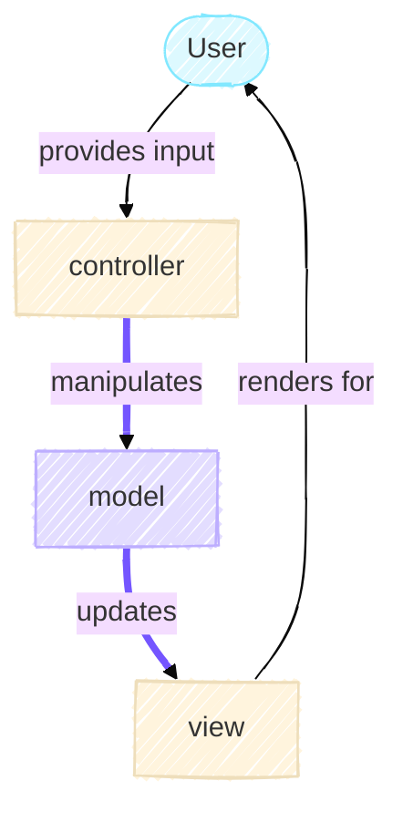
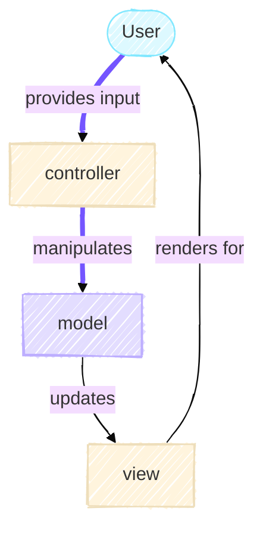

# The Model

<!-- TODO: ADD IN link to MVC article overview  -->
The Model is the centerpiece of the Game of Life simulation.
It's responsible for maintaining the game state and computing how that state evolves over time. In the Model-View-Controller (MVC) architecture, the Model knows nothing about how it's being displayed or which buttons the user is clicking. It only understands one thing - the rules of Conway's Game of Life and how to apply them.

## Understanding Conway's Game of Life

Conway's Game of Life is a cellular automaton where cells on a grid live or die based on simple rules. These rules are beautifully elegant:

1. A live cell with 2 or 3 live neighbors survives to the next generation
2. A dead cell with exactly 3 live neighbors becomes alive
3. All other cells die or stay dead

That's it. From these three rules, complex and often unpredictable patterns emerge. Some configurations oscillate endlessly. Others move across the grid like spaceships. Still others produce intricate structures that change in fascinating ways.

{align=left}
///caption
The neighbours of a cell comprises all orthogonal and diagonal adjacent cells, giving eight neighbours in total.
///

### From Rules to Code: The Single Responsibility Principle

When we translate these rules into code, we face an interesting design decision. We could write one large method that computes the next generation and updates the grid. But notice that Conway's rules describe two distinct concerns,

1. Computing what the next generation should be
2. Advancing the simulation

As such, our implementation splits these concerns into two methods. The `GameOfLife` class provides `compute_next_generation()` and `step()`.
This split follows the Single Responsibility Principle. The former applies Conway's rules. The latter coordinates the simulation's progression and maintain the history. Separating these makes the code easier to test. For example, the computation of the next generation can be tested independently of the stepping.

```python title="model.py in GameOfLife class"
    def compute_next_generation(self) -> NDArrayU8:

```

This method computes the next generation by first determining how many neighbours are alive. Using the `np.roll` function we can shift the grid to get a neighboring value at the current index. By adding up all neighbours, we can determine how many neighbours are alive. The next steps involve applying the rules of the game and handling the boundary. These two steps result in an array of what the grid will look like at the next step. Thus, this method has only one responsibility.

```python title="model.py in GameOfLife class"
    def step(self) -> None:
        self._generation += 1
        self._grid = self.compute_next_generation()
        self._history.append(self._grid)
```

This method is responsible for coordinating all the different components involved in moving from one time step to the next. It is also the means for Controller to manipulate the Model such that it updates for the View. This corresponds to the parts in purple in the MVC diagram below



!!! info "Info: Naming Convention"

    In the snippets above, you might've noticed that the some of the fields on the class start with a `_`, e.g. `#!py self._grid` and `#!py self._generation`. This is [indicate that it is meant for internal use](https://peps.python.org/pep-0008/#descriptive-naming-styles).

    In typed languages like C++ and Java, [access modifiers](https://en.wikipedia.org/wiki/Access_modifiers) are used to specify the "accessiblity of classes, methods, and other members".

    {width=600}
    ///caption
    Class diagram of the Example class with access modifiers. In [C++ these accesss specifiers](https://en.cppreference.com/cpp/language/access) they mean: `public` ⇒ visible to everyone; `protected` ⇒ visible to child and/or [friend](https://en.cppreference.com/cpp/language/friend) classes; and `private` ⇒ only visible to the class.
    ///

### Grid as a Data Container

The grid is represented as a 2D NumPy array in which each cell holds a value of either 0 (dead) or 1 (alive). The `GameOfLife` object owns and manages this array and `#!py self._grid` is not intended to be accessed by the outside. This is to [encapsulate the data](https://en.wikipedia.org/wiki/Encapsulation_(computer_programming)) for [information hiding](https://en.wikipedia.org/wiki/Information_hiding)
By restricting modification to the `GameOfLife` object itself, the state of the grid remains predictable and controlled throughout the program's execution.

!!! note
    As Python does not support variable access restrictions, it is not possible to enforce this restriction. In fact, even in languages like Java which has these restrictions and enforces it, they can be circumvented using an advanced feature called [reflection](https://en.wikipedia.org/wiki/Reflective_programming).

{width="400" align=right}

This is an example of [composition in object-oriented design](https://realpython.com/inheritance-composition-python/#whats-composition). This a relationship in which one object owns another as an attribute. Here, the grid is a constituent part of the `GameOfLife` object, not an external dependency. This can be understood through a simple distinction: a grid _is not_ a `GameOfLife` (which rules out inheritance), but a `GameOfLife` _has a_ grid (which confirms composition). This _has-a_ relationship is what determines how the two are structured and how ownership is assigned in the code.

!!! tip
    There are two major concepts in object oriented programming (OOP): inheritance and composition. A heuristic to determine what the most appropriate relationship between the two is to use the _is-a_ and _has-a_ test. For example, a cat _is a_ animal. So, a `Cat` class should inherit from a parent `Animal` class. And a cat _has a_ tail. So, a `Cat` should contain an object of `Tail`. It would be incorrect for the `Tail` to inherit from the `Cat` class as a `Tail` is not a `Cat`.

!!! abstract "Further Reading"
    Another design pattern related to inheritance and composition is to [favour composition over inheritance](https://en.wikipedia.org/wiki/Composition_over_inheritance) to give a design more flexibility.

## Grid Initialization

How the Game of Life progresses is directly linked to how the grid is initialized. We want to give the user the ability to choose from multiple initialization strategies:

- Start with all dead cells
- Start with a random configuration
- Start with a specific pattern

We could write three separate constructors for `GameOfLife`, but that quickly becomes messy. Each constructor would duplicate code. More importantly, adding a fourth strategy would require modifying `GameOfLife` again.

In our MVC diagram, this is where input from the user can flow from the Controller to manipulate the Model.



### The Strategy Pattern

The solution is to use the [Strategy Pattern](https://en.wikipedia.org/wiki/Strategy_pattern). This pattern encapsulates different algorithms into separate classes that all follow the same interface. In this case, each initialization strategy becomes its own class. The `GameOfLife` object doesn't care which strategy is used. It just knows that whatever it receives implements the `GridCreator` interface. We define this interface as an abstract base class,

```python title="model.py (excerpt)"
class GridCreator(ABC):
    @abstractmethod
    def initialise(self, n_rows: int, n_cols: int) -> NDArrayU8:
        ...
```

The `GridCreator` class inherits from [`ABC`](https://docs.python.org/3/library/abc.html#abc.ABC), which marks it as an abstract base class. The [`@abstractmethod` decorator](https://docs.python.org/3/library/abc.html#abc.abstractmethod) on `initialise()` requires any concrete subclass to implement this method. This contract ensures that every strategy provides the same interface.

!!! note
    Similar concepts exist in other languages for expressing that different data structures share a common [interface](https://en.wikipedia.org/wiki/Interface_(object-oriented_programming)), though the exact terminology and semantics vary. Java uses `interface` and Rust uses `traits`, for example. While these are not directly equivalent, they address the same fundamental problem of defining a contract that a type must fulfill without prescribing how that contract is implemented.

Since the abstract class itself cannot be instantiated, it forces us to provide concrete implementations for each strategy.

To initialize the grid, the `GameOfLife` constructor receives an object which implements the `GridCreator` interface and uses it to initialize the grid:

```python title="model.py (excerpt)"
class GameOfLife:
    def __init__(
        self,
        n_rows: int = 50,
        n_cols: int = 50,
        wrap: bool = True,
        grid_creator: GridCreator | None = None,
    ) -> None:
        if grid_creator is None:
            grid_creator = ZerosGridCreator()
        self._grid: NDArrayU8 = grid_creator.initialise(n_rows, n_cols)
```

By depending on an abstraction rather than a concrete implementation, GameOfLife requires no knowledge of which strategies exist. It contains no conditional logic for selecting between them.
Instead, it delegates the work to whatever strategy object it receives. The decision about which strategy to use happens elsewhere, typically in the Controller or a factory class.

This design directly supports the Open-Closed Principle — the system is open for extension but closed for modification. Consider a scenario common in research: a new initialization strategy is required that loads a predefined pattern from an experimental dataset. This is achieved by implementing a new class, for example, `ExperimentalDataGridCreator`, that inherits from `GridCreator` and provides a concrete implementation of `initialise()`. Crucially, the `GameOfLife` class requires no modification. The system has been extended without altering existing, validated code. Without this abstraction, each new strategy would require changes to `GameOfLife` itself, introducing complexity and the risk of regressions with every addition.

### Concrete Classes

To achieve our goal, we have defined three concrete classes for creating our grid,

- `ZerosGridCreator`: Returns a grid of all zeros
- `RandomGridCreator`: Fills the grid with random live and dead cells of a specified density of live cells
- `PatternGridCreator`: Places a specific pattern in the grid

Each of the grid creators need different information in order to achieve it's goal. For example, the `RandomGridCreator` requires information about the density of the live cells while `PatternGridCreator` does not need this information but needs the pattern to be passed in. However, the `initialise()` method is fixed [method signature](https://en.wikipedia.org/wiki/Type_signature#Signature) and doesn't allow us to provide more information. So, how do we solve this problem?

As each concrete implementation is a class, we can store this information as an [instance variable](https://docs.python.org/3/tutorial/classes.html#class-and-instance-variables). For example,

```python title="model.py (excerpt)"
class RandomGridCreator(GridCreator):
    def __init__(self, density: float = 0.2, rng_seed: int | None = None) -> None:
        self._density: float = density
        self._rng_seed: int | None = rng_seed
```

When instantiating the `RandomGridCreator` class, we're able to pass in additional variables that are stored. These stored variables are then used in the concrete implementation of the `initialise()` method.

```python title="model.py (excerpt)"
class RandomGridCreator(GridCreator):
    @override
    def initialise(self, n_rows: int, n_cols: int) -> NDArrayU8:
        return np.random.default_rng(seed=self._rng_seed).choice(
            [0, 1], size=(n_rows, n_cols), p=np.asarray([1 - self._density, self._density])
        )
```

## Encoding Patterns with Run Length Encoding

Testing and initializing the Game of Life with known patterns requires a compact and reliable way to represent grid states. Storing a full 2D array for each pattern is inefficient — the majority of cells in a typical pattern are dead, making dense representation unnecessarily costly. Instead, grid patterns are encoded using [Run Length Encoding (RLE)](https://en.wikipedia.org/wiki/Run-length_encoding), a compression format well-suited to sparse data of this kind.

### What is the Encoding?

The encoding selected here is to be compatible with other Game of Life software like [Golly](https://golly.sourceforge.io/). Moreover, [this website](https://conwaylife.com/book/patterns/) provides example patterns in this encoding. The RLE format works as follows:

- `'b'` represents a dead cell
- `'o'` represents a live cell
- `'$'` represents end of line (row separator)
- Numbers before a character indicate repetition (e.g., `'3b'` = `'bbb'`)
- `'!'` marks the end of the pattern

The example $3 \times 3$ pattern string: `"3b$bob$2b!"` represents,
```
    b b b
    b o b
    b b (b)
```

The final cell is `(b)` as it is not explicitly set as being a dead cell by the pattern. But, it would be equivalent to setting it as a dead cell.

This encoding offers two practical advantages: compactness and human-readability. A pattern can be inspected and understood directly from its RLE representation, without the need to load image files or deserialize large arrays.

### Validating Patterns with Pydantic

The `Pattern` class is responsible for storing the RLE encoding of a given pattern and decoding it into a populated 2D array for use by the simulation. It is implemented using [Pydantic](https://pydantic.dev/docs/validation/latest/get-started/), a data validation library for Python. `Pydantic` models extend the functionality of standard data classes by performing automatic validation at instantiation. This ensures that any malformed or unexpected data is caught at the point of entry, before it can propagate through the rest of the system.

In this way, `Pattern` acts as the receptacle for user input and serves as a natural point of dependency injection whereby a validated `Pattern` instance is constructed from user-provided data and injected into the relevant `GridCreator`, which uses it to initialize the grid without needing to know where the data originated or how it was validated. This reflects two of the SOLID principles established earlier. Firstly, the Single Responsibility Principle, in that `Pattern` is solely concerned with the storage and decoding of pattern data and nothing else, and the Dependency Inversion Principle, in that higher-level components such as `GridCreator` depend on the abstraction of a validated `Pattern` object rather than on the specifics of how that data was sourced or constructed. Together, these properties ensure that the input handling, validation, and initialization concerns remain cleanly separated and independently testable.

```python title="model.py"
from pydantic import BaseModel, PositiveInt, StringConstraints

class Pattern(BaseModel):
    width: PositiveInt
    height: PositiveInt
    encoded_pattern: Annotated[
        str, StringConstraints(strip_whitespace=True, to_lower=True, pattern=r"^(\d*[bo$])*!$", min_length=1)
    ]
```

This class uses two `pydantic` constructs to perform the validation,

1. `PositiveInt` type automatically rejects negative or zero values.
2. `StringConstraints` validates the RLE string against two conditions. The first ensures the string is not empty by enforcing a minimum length of 1. The second checks that the string matches the regular expression `^(\d*[bo$])*!$`, which ensures there are no invalid characters and that the string conforms to the expected RLE structure, i.e. there are zero or more occurrences of an optional digit count followed by a cell character (`b`, `o`, or `$`), terminated by `!`.

If the user passes invalid input, a `ValidationError` is raised immediately.

!!! note
    These validations are performed during the instantiation of the `Pattern` class, i.e. within the `__init__()` method. Thus, instances of `Pattern` must have passed the validation.

As these checks are not sufficient to ensure that pattern is valid, there are two additional levels of check. The first occurs at the [field level](https://pydantic.dev/docs/validation/latest/concepts/validators/#field-validators) using the `pydantic` [`@field_validator` decorator](https://pydantic.dev/docs/validation/latest/api/pydantic/functional_validators/#pydantic.functional_validators.field_validator) on the `encoded_pattern` instance variable after the initial checks (mentioned above) are performed.

```python
class Pattern(BaseModel):
    @field_validator("encoded_pattern", mode="after")
    @classmethod
    def validate_pattern_string(cls, pattern_str: str) -> str:
        without_end: str = pattern_str[:-1]

        # Check that all numbers are > 0
        #   Pattern contains two groups: 1) any digits (\d+), 2) token characters b, o or $ ([bo$])
        #   Thus, group 1 will contain the count for a given token
        pattern_for_counts = r"(\d+)([bo$])"
        for match in re.finditer(pattern_for_counts, without_end):
            if int(match.group(1)) == 0:
                raise ValueError(f"Run count cannot be 0 at {match.start()}")

        return without_end
```

This validation is required as the regex pattern can only check for digits. However, our RLE is only valid for non-zero digits. The [`validate_pattern_string()` method](https://github.com/ImperialCollegeLondon/ReCoDE-research-python-patterns/blob/main/src/game_of_life/model.py#L92-L129) checks for counts which are `0` and raises an error if one is found. Since this additional step is required, we take this opportunity to remove the terminating `!` to make decoding the pattern easier.

As the user specifies the width and height of the pattern, we are able to check that this aligns with the pattern provided. Since multiple fields are required to perform this validation, it must be performed at the [model level](https://pydantic.dev/docs/validation/latest/concepts/validators/#model-validators) using the `pydantic` [`@model_validator()`decorator](https://pydantic.dev/docs/validation/latest/api/pydantic/functional_validators/#pydantic.functional_validators.model_validator) after all of the aforementioned checks have been completed. The `Pattern` methods [`check_height_matches_pattern()`](https://github.com/ImperialCollegeLondon/ReCoDE-research-python-patterns/blob/main/src/game_of_life/model.py#L161-L192) and [`check_width_matches_pattern()`](https://github.com/ImperialCollegeLondon/ReCoDE-research-python-patterns/blob/main/src/game_of_life/model.py#L194-L224) define these validations.

These validators enforce correctness at the point of instantiation, in keeping with the principle of [defensive programming](https://en.wikipedia.org/wiki/Defensive_programming). This is the practice of writing code that anticipates and guards against invalid or unexpected inputs rather than assuming they will never occur. This is particularly important in research software, where silent failures can be difficult to detect and may propagate through an analysis unnoticed, producing results that appear plausible but are subtly incorrect. If a `Pattern` is constructed with inconsistent data (for example, `width=3`, `height=3` paired with an RLE string encoding a $4 \times 4$ pattern), Pydantic will reject the object immediately, raising a validation error before the inconsistency can propagate through the system and produce a silent or difficult-to-diagnose failure downstream.

## How the Components Work Together

The Model comprises three well-defined components, each with a distinct responsibility:

1. `GameOfLife` implements the core simulation logic. It maintains the grid state, applies Conway's rules, and tracks the history of generations. The separation between `compute_next_generation()` and `step()`, introduced in [From Rules to Code](#from-rules-to-code-the-single-responsibility-principle), ensures that the simulation logic remains independently testable in accordance with the unit testing principles outlined in the [MVC overview](#).
2. `GridCreator` manages grid initialization through the [Strategy Pattern](#the-strategy-pattern). Each concrete implementation — `ZerosGridCreator`, `RandomGridCreator`, and `PatternGridCreator` — encapsulates its own initialization logic, as detailed in [Concrete Classes](#concrete-classes). `GameOfLife` accepts any `GridCreator` without requiring knowledge of the specific implementation, and this flexibility introduces no additional complexity into `GameOfLife` itself.
3. `Pattern` enforces the validity of user-provided input through the layered validation described in [Validating Patterns with Pydantic](#validating-patterns-with-pydantic). Once a `Pattern` instance has been successfully constructed, its internal consistency is guaranteed. Both `GameOfLife` and `GridCreator` can consume it with confidence, without needing to perform additional checks on the data.

These three components operate together as a cohesive system. When a specific pattern is required, the Controller constructs a `Pattern` object from user input, which `pydantic` validates at instantiation. The Controller then constructs a `PatternGridCreator` with the validated `Pattern` and passes it to `GameOfLife` via its constructor. The Model receives its dependencies through constructor injection and has no knowledge of where the pattern originated or how it was validated. This is a direct application of the Dependency Inversion Principle, as introduced in [Validating Patterns with Pydantic](#validating-patterns-with-pydantic).

A key property of this design is that the Model is entirely isolated from user interface concerns. `GameOfLife` has no dependencies on any View library and no knowledge of how results are displayed or how the user interacts with the system. Its scope is strictly limited to cells, grids, and the rules of Conway's Game of Life. This isolation is what makes the Model thoroughly testable in the absence of any View or Controller code. This is consistent with the defensive programming principles established in [Validating Patterns with `pydantic`](#validating-patterns-with-pydantic) and the testing principles outlined in the [MVC overview](#).

This is the Open/Closed Principle in practice, the Model is open for extension, (e.g. introducing new visualizations, interaction patterns, and initialization strategies) without requiring modification to the Model itself. The Model evolves only in response to changes in the problem domain, not in response to interface or presentation requirements.

For researchers, these design decisions have tangible benefits. The abstractions established through the Strategy Pattern, the validation provided by `Pattern`, and the encapsulation in `GameOfLife` make the system easier to extend, test, and maintain. New experiments, visualizations, or analysis methods can be introduced without disrupting the core simulation. This is the separation of concerns that motivates MVC, as discussed in the overview.
