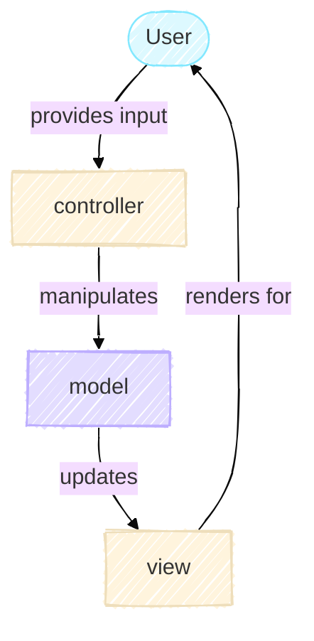

# The Model

<!-- TODO: ADD IN link to MVC article overview  -->
The Model is the centerpiece of the Game of Life simulation.
It's responsible for maintaining the game state and computing how that state evolves over time. In the Model-View-Controller (MVC) architecture, the Model knows nothing about how it's being displayed or which buttons the user is clicking. It only understands one thing - the rules of Conway's Game of Life and how to apply them.

## Understanding Conway's Game of Life

Conway's Game of Life is a cellular automaton where cells on a grid live or die based on simple rules. These rules are beautifully elegant:

1. A live cell with 2 or 3 live neighbors survives to the next generation
2. A dead cell with exactly 3 live neighbors becomes alive
3. All other cells die or stay dead

That's it. From these three rules, complex and often unpredictable patterns emerge. Some configurations oscillate endlessly. Others move across the grid like spaceships. Still others produce intricate structures that change in fascinating ways.

### From Rules to Code: The Single Responsibility Principle

In this section, we are focusing solely on the model (purple rectangle in the diagram below) in our MVC architecture.



When we translate these rules into code, we face an interesting design decision. We could write one large method that computes the next generation and updates the grid. But notice that Conway's rules describe two distinct concerns,

1. Computing what the next generation should be
2. Advancing the simulation

As such, our implementation splits these concerns into two methods. The `GameOfLife` class provides `compute_next_generation()` and `step()`.
This split follows the Single Responsibility Principle. The former applies Conway's rules. The latter coordinates the simulation's progression and maintain the history. Separating these makes the code easier to test. For example, the computation of the next generation can be tested independently of the stepping.

```python title="model.py in GameOfLife class"
    def compute_next_generation(self) -> NDArrayU8:

```

This method computes the next generation by first determining how many neighbours are alive. Using the `np.roll` function we can shift the grid to get a neighboring value at the current index. By adding up all neighbours, we can determine how many neighbours are alive. The next steps involve applying the rules of the game and handling the boundary. These two steps result in an array of what the grid will look like at the next step. Thus, this method has only one responsibility.

```python title="model.py in GameOfLife class"
    def step(self) -> None:
        self._generation += 1
        self._grid = self.compute_next_generation()
        self._history.append(self._grid)
```

This method is responsible for coordinating all the different components involved in moving from one time step to the next.
