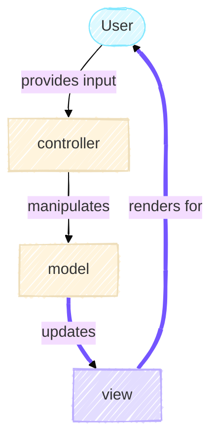

# The View

**Estimated read time:** 10 minutes

The View is the presentation layer of the MVC architecture. While the Model holds the game state and knows nothing about how it's displayed, and the Controller orchestrates the flow, the View is responsible for making the game visible to the user. In Conway's Game of Life, multiple visualization strategies might be equally valid: a terminal display, a plotting window, or even a web interface. The View layer enables this flexibility.


## The MVC Loop

Recall the MVC diagram from the Model section. The flow is unidirectional from the Model to the View by updating it. When the controller tells the model to step forward in time, the model computes the next generation. The view then displays this new state to the user.



The Model emits no output itself. It simply holds state. The View asks the Model for its current state &ndash; specifically, the grid and the generation number &ndash; and transforms that data into a human-readable format. This separation ensures that adding a new visualization method requires only a new View implementation, not changes to the Model.

## Polymorphism Through Abstraction

In the [`src/game_of_life/view` directory](https://github.com/ImperialCollegeLondon/ReCoDE-research-python-patterns/tree/main/src/game_of_life/view), there are three files: [`base.py`](https://github.com/ImperialCollegeLondon/ReCoDE-research-python-patterns/blob/main/src/game_of_life/view/base.py), [`cli.py`](https://github.com/ImperialCollegeLondon/ReCoDE-research-python-patterns/blob/main/src/game_of_life/view/cli.py), and [`plot.py`](https://github.com/ImperialCollegeLondon/ReCoDE-research-python-patterns/blob/main/src/game_of_life/view/plot.py). Let's start with the abstract foundation.

### The `BaseView` Abstract Class

All view implementations inherit from `BaseView`, which itself inherits from `AbstractContextManager`,

```python title="view/base.py"
from abc import abstractmethod
from contextlib import AbstractContextManager

class BaseView(AbstractContextManager):
    """Abstract base class for all Game of Life visualization views."""

    @abstractmethod
    def render(self, game: "GameOfLife") -> None:
        """Display the current state of the Game of Life simulation."""
        ...
```

!!! quote "Definition - context manager"

    In Python, a [context manager](https://docs.python.org/3/reference/datamodel.html#with-statement-context-managers) "is an object that defines the runtime context to be established when executing a `with` statement. The context manager handles the entry into, and the exit from, the desired runtime context for the execution of the block of code."

By inheriting from [`AbstractContextManager`](https://docs.python.org/3/library/contextlib.html#contextlib.AbstractContextManager), it makes the resource management explicit. Views often need to allocate resources, for example, a CLI view sets up a live display, a plotting view opens a figure window. By inheriting from `AbstractContextManager`, we enforce that concrete views implement [`__enter__()`](https://docs.python.org/3/reference/datamodel.html#object.__enter__) and [`__exit__()`](https://docs.python.org/3/reference/datamodel.html#object.__exit__) methods.  This ensures these resources are properly initialized when we enter a [`with`](https://docs.python.org/3/reference/compound_stmts.html#with) block and cleanly released when we exit, even if an error occurs.

??? note "Note on Python `__magic__()` methods"
    These methods which start and end with a double underline, e.g. `__name-of-method__()`, are called [magic or special or dunder methods](https://realpython.com/python-magic-methods/#getting-to-know-pythons-magic-or-special-methods) in Python.

This pattern is an application of the *context manager protocol*, which is a Python idiom for reliable resource management. Combined with the [`@abstractmethod`](https://docs.python.org/3/library/abc.html#abc.abstractmethod) [decorator](https://realpython.com/primer-on-python-decorators/) on `render()`, it means any concrete view *must* implement three methods to satisfy the interface: `__enter__()`, `__exit__()`, and `render()`.

The design choice ensure that the constraints are made explicit in code. By using [abstract base classes](https://docs.python.org/3/library/abc.html), we communicate to other programmers (or our future selves) exactly what a view must do, before they write a single line of a new view class.

### Concrete Views

#### CLI View: Terminal Output with `rich`

The `CliView` displays the Game of Life in the terminal using the [`rich`](https://rich.readthedocs.io/en/stable/) library, which provides tools for beautiful text formatting:

```python title="view/cli.py" linenums="1"
class CliView(BaseView):
    ALIVE_CELL: ClassVar[str] = "\u2588"  # Unicode for full block █
    DEAD_CELL: ClassVar[str] = " "

   def __init__(self, time_between_generations: float) -> None:
        super().__init__() # (1)
        self.console: Console = Console()
        # When time between generations is < 1, +1 is to guarantee that refresh rate is higher than frequency of data
        # Otherwise, it can refresh twice a second and still be faster than the refresh rate
        refresh_per_second: int = int(np.ceil(1 / time_between_generations)) + 1 if time_between_generations < 1 else 2
        self.live_display: Live = Live(console=self.console, refresh_per_second=refresh_per_second, screen=True)
        self._time_between_gens: float = time_between_generations

```

1. Calls the parent's `__init__()` method. As the parent (`BaseView`) has an empty initializer, this is not strictly necessary, however, it is good coding practice and will catch issues if the parent's `__init__()` method changes.

In line 2 and 3 in the code block above are the class variables `ALIVE_CELL` and `DEAD_CELL`. The naming convention of [`UPPER_CASE_WITH_UNDERSCORES`](https://peps.python.org/pep-0008/#descriptive-naming-styles) has been used to signal to readers that this is a [constant](https://peps.python.org/pep-0008/#constants). In addition, the [`ClassVar` type annotation](https://docs.python.org/3/library/typing.html#typing.ClassVar), further signals to readers that this is class variable.
These class variables store the visual symbols for live cells and a space for dead cells. Here, a full Unicode block character has been used to allow for the display to look professional and handle different terminal widths gracefully.

The [`Console` object from `rich`](https://rich.readthedocs.io/en/stable/reference/console.html#module-rich.console) is their abstraction of the console and manages the terminal output. The [`Live` object](https://rich.readthedocs.io/en/stable/reference/live.html#rich.live.Live) provides live-updating capabilities. By initializing the `Live` instance with the `Console` instance in line 83, it allows for the console output to be updated with a specified refresh rate. In line 82, the refresh rate is calculated to always be faster than the generation interval, ensuring smooth animation.

When the `CliView` class is invoked with a `with` statement, the `__enter__()` method is executed,

```python title="view/cli.py" linenums="1"
class CliView(BaseView):
    @override
    def __enter__(self) -> Self:
        self.console.print("[bold cyan]Conway's Game of Life[/bold cyan]")
        self.console.print("[dim]Press Ctrl+C to stop[/dim]\n")
        time.sleep(1) # (1)
        self.live_display.start()
        return self # (2)
```

1. Sleeps for 1 second so that the text printed to the console remains there for a while before being replaced by the live display
2. To conform to the `__enter__()` signature, `self` needs to be returned

The [`@override`](https://typing.python.org/en/latest/spec/class-compat.html#override) decorator in line 2 is to signal to the type checker and readers that this [method overriding](https://en.wikipedia.org/wiki/Method_overriding) takes place here. This means that this class is replacing the implementation of the implementation of the parent class. In this case, it is providing a concrete implementation of the parent `BaseView`.

This method instructs the user what this is for and how to stop it in lines 4 and 5. [`rich` allows for colours and styles](https://rich.readthedocs.io/en/stable/markup.html) to be specified for the output in the console. This simplifies the process of building a pretty CLI tool that highlights the right information to your user. For the example here, the name of this tool is in bold while the exit information (which is less important) has been dimmed.
In line 7, the live display that was instantiated is started. This replaces any text in the terminal with this display.

When it comes to rendering, it is important to note that the model stores the grid in an array of ones and zeros. Thus, we need to convert this into a string which can be displayed by the terminal. This is performed using the `map_to_string()` method which transforms the numeric grid into visual output,

```python title="view/cli.py"
class CliView(BaseView):
    def map_to_string(self, arr: np.ndarray) -> str:
        if arr.ndim != 2: # (1)
            raise ValueError("Array must have two dimensions")
        chars = np.where(arr == 1, self.ALIVE_CELL, self.DEAD_CELL)
        return "\n".join("".join(row) for row in chars)
```

1. Defensively perform check to ensure that the array only has two dimensions

This function takes in a grid and produces a string, with no [side effects](https://en.wikipedia.org/wiki/Side_effect_(computer_science)). Here, it use [NumPy's `where()`](https://numpy.org/doc/stable/reference/generated/numpy.where.html#numpy.where) to swap 1s and 0s for visual characters, then join them into a multi-line string.

The `render()` method then wraps this string in a [`Panel`](https://rich.readthedocs.io/en/stable/panel.html) for visual formatting which is used to update the `#!py self.live_display`,

```python title="view/cli.py"
class CliView(BaseView):
    @override
    def render(self, game: "GameOfLife") -> None:
        board = self.map_to_string(game.grid) # (1)
        panel = Panel(
            board,
            title=f"Conway's Game of Life - Generation {game.generation}",
            border_style="green",
        )
        self.live_display.update(panel)
        time.sleep(self._time_between_gens) # (2)
```

1. Maps the model state to a format that can be "understood" by the view
2. `time.sleep()` is to prevent everything from being displayed at once. This forces some time between the generations such that the progression between the generations can be seen by the human.

When you call `render`, it asks the game for its grid and generation, converts the grid to a visual string, and updates the live display. The sleep ensures the animation plays at the intended speed.

#### Plot View: Matplotlib Animation

The `PlotView` takes a different approach. Rather than displaying live in the terminal, it collects frames during rendering and assembles them into an animation at the end:

```python title="view/plot.py"
class PlotView(BaseView):
    def __init__(self, output_path: Path | None = None) -> None:
        self.output_path = output_path
        self._cmap = ListedColormap(["white", "black"])
        self.fig, self.ax = plt.subplots(constrained_layout=True)
        self._frame_artists = []
```

- The `#!py self._cmap` is a custom colourmap, white for dead cells, black for live cells.
- The `matplotlib` [`Figure`](https://matplotlib.org/stable/api/_as_gen/matplotlib.figure.Figure.html#matplotlib.figure.Figure) and [`Axes`](https://matplotlib.org/stable/api/axes_api.html#the-axes-class) (stored in `#!py self.fig` and `#!py self.ax` respectively) have been instantiated using the `#!py plt.subplots()`. When instantiated, the [`constrained_layout=True`](https://matplotlib.org/stable/users/explain/axes/constrainedlayout_guide.html) keyword argument is used to create cleaner plots with less white space. For users familiar with `tight_layout()`, this is preferred over `tight_layout()` (see [tight layout guide tip](https://matplotlib.org/stable/users/explain/axes/tight_layout_guide.html)) as constrained layout uses a more modern algorithm.
- The `#!py self._frame_artists` list accumulates frames for later animation.

The setup of the plotting view is fairly straightforward whereby the title is set and axis ticks are disabled.

```python title="view/plot.py"
class PlotView(BaseView):
    @override
    def __enter__(self) -> Self:
        # Set title of figure
        _ = self.fig.suptitle("Game of Life")

        # Disable axis ticks
        _ = self.ax.set_xticks([])
        _ = self.ax.set_yticks([])
        return self
```

!!! note

    In `__enter__()`, the `matplotlib` methods have the side effect  of setting values and does return a value. However, the returned value is not used. Hence, it has been set to the variable `_` to indicate that it is not used.

    This is not strictly necessary, especially for `matplotlib` methods. However, it is a style that I find useful when working with functions that I know return a value but that has been discarded as only the side effects are desired.

```python title="view/plot.py"
class PlotView(BaseView):
    @override
    def render(self, game: "GameOfLife") -> None:
        self._frame_artists.append([self.ax.imshow(game.grid, cmap=self._cmap, interpolation="nearest")])
```

To render the changes to the model, the `matplotlib` [`Axes.imshow()`](https://matplotlib.org/stable/api/_as_gen/matplotlib.axes.Axes.imshow.html) method is used to display the information. This returns an `AxesImage` instance which implements the `matplotlib.artist.Artist` abstract base class. Thus, the rendering step simply stores a matplotlib image of the current grid. No animation happens here. Instead, all the animation logic lives in `__exit__`,

```python title="view/plot.py"
class PlotView(BaseView):
    @override
    def __exit__(self, *exc_details: Any) -> None:
        animated = animation.ArtistAnimation(
            self.fig,
            self._frame_artists,
            interval=self.INTERVAL,
            blit=True,
            repeat=True,
        )

        if self.output_path is None:
            plt.show()
        else:
            animated.save(
                self.output_path,
                savefig_kwargs={"bbox_inches": "tight"},
            )
        plt.close(self.fig)
```

Upon exiting the `PlotView` context, the animation is created using [`ArtistAnimation`](https://matplotlib.org/stable/api/_as_gen/matplotlib.animation.ArtistAnimation.html#matplotlib.animation.ArtistAnimation). This uses the created artists stored in `!#py self._frame_artists` as each frame of the animation.

This design decision in `PlotView` defers expensive operations (animation creation and saving) until the end. This is more efficient as you avoid recreating the animation after every single render. Instead, the frames are collected and the animation is assembled once when the context exits. If `output_path` is `None`, the animation is displayed interactively; otherwise, it's saved to file (MP4, GIF, etc.).

For more details on how matplotlib animations work, see the [matplotlib animation documentation](https://matplotlib.org/stable/users/explain/animations/animations.html).

## Summary

### Design patterns used

- *Strategy Pattern*: Each view class is a different strategy for visualization. The controller doesn't know or care which strategy is active, it just calls `render()` on whatever view it was given.
- *Polymorphism*: Because all views implement the same interface, the controller can treat them uniformly. The polymorphism is what enables the strategy pattern to be effective as a given method results in different behaviours depending on the object's type.
- *Context Manager Protocol*: By using `with` statements, resources (display windows, file handles, live terminals) are guaranteed to be cleaned up, even if an exception occurs.

### Putting It Together

The controller doesn't instantiate views directly with complex logic. Instead, it receives a view and uses it like this,

```python
with view:
    for generation in range(num_generations):
        view.render(game)
        game.step()
```

The simplicity makes it clear. The view's job is to display; the model's job is to compute; the controller's job is to coordinate. Each has a single responsibility, and they communicate through well-defined interfaces.

By designing views as interchangeable strategies that adhere to a common abstract interface, we've made it trivial to add new visualizations without modifying the existing code.
