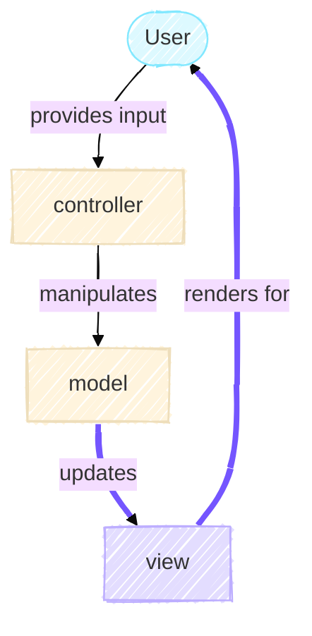

# The View

The View is the presentation layer of the MVC architecture. While the Model holds the game state and knows nothing about how it's displayed, and the Controller orchestrates the flow, the View is responsible for making the game visible to the user. In Conway's Game of Life, multiple visualization strategies might be equally valid: a terminal display, a plotting window, or even a web interface. The View layer enables this flexibility.

## The MVC Loop

Recall the MVC diagram from the Model section. The flow is unidirectional in one direction: the Model updates the View. When the controller tells the model to step forward in time, the model computes the next generation. The view then displays this new state to the user.



The Model emits no output itself. It simply holds state. The View asks the Model for its current state, specifically, the grid and the generation number—and transforms that data into a human-readable format. This separation is intentional. It ensures that adding a new visualization method requires only a new View implementation, not changes to the Model.

## Polymorphism Through Abstraction

In the `src/game_of_life/view` directory, there are three files: `base.py`, `cli.py`, and `plot.py`. Let's start with the abstract foundation.

### The `BaseView` Abstract Class

All view implementations inherit from `BaseView`, which itself inherits from `AbstractContextManager`:

```python title="view/base.py"
from abc import abstractmethod
from contextlib import AbstractContextManager

class BaseView(AbstractContextManager):
    """Abstract base class for all Game of Life visualization views."""

    @abstractmethod
    def render(self, game: "GameOfLife") -> None:
        """Display the current state of the Game of Life simulation."""
        ...
```

Why inherit from `AbstractContextManager`? This is a design decision that makes resource management explicit. Views often need to allocate resources, for example, a CLI view sets up a live display, a plotting view opens a figure window. By inheriting from `AbstractContextManager`, we enforce that concrete views implement `__enter__` and `__exit__` methods. This ensures these resources are properly initialized when we enter a `with` block and cleanly released when we exit, even if an error occurs.

This pattern is an application of the *context manager protocol*, which is a Python idiom for reliable resource management. Combined with the `@abstractmethod` decorator on `render`, it means any concrete view *must* implement three methods to satisfy the interface: `__enter__`, `__exit__`, and `render`.

The design choice here reflects a principle: *make constraints explicit in code*. By using abstract base classes, we communicate to other programmers (or our future selves) exactly what a view must do, before they write a single line of a new view class.

### Concrete Views

Polymorphism means "many forms." Here, we have one interface (`BaseView`) but multiple implementations.

#### CLI View: Terminal Output with `rich`

The `CliView` displays the Game of Life in the terminal using the `rich` library, which provides tools for beautiful text formatting:

```python title="view/cli.py"
class CliView(BaseView):
    """Terminal-based view for displaying the Game of Life simulation."""

    ALIVE_CELL: ClassVar[str] = "\u2588"  # Unicode for full block █
    DEAD_CELL: ClassVar[str] = " "

    def __init__(self, time_between_generations: float) -> None:
        self.console: Console = Console()
        refresh_per_second: int = int(np.ceil(1 / time_between_generations)) + 1
        self.live_display: Live = Live(
            console=self.console,
            refresh_per_second=refresh_per_second,
            screen=True
        )
        self._time_between_gens: float = time_between_generations
```

Notice the class variables `ALIVE_CELL` and `DEAD_CELL`. These represent the visual symbols, a full Unicode block character for live cells and a space for dead cells. Using Unicode allows the display to look professional and handle different terminal widths gracefully.

The `Console` object from `rich` manages the terminal output, and the `Live` object provides live-updating capabilities. The refresh rate is calculated to always be faster than the generation interval, ensuring smooth animation.

The `map_to_string` method transforms the numeric grid into visual output:

```python title="view/cli.py"
def map_to_string(self, arr: np.ndarray) -> str:
    """Convert a 2D numpy array to a string representation."""
    assert arr.ndim == 2
    chars = np.where(arr == 1, self.ALIVE_CELL, self.DEAD_CELL)
    return "\n".join("".join(row) for row in chars)
```

This is a pure function, it takes in a grid and produces a string, with no side effects. Here, it use NumPy's `where` to swap 1s and 0s for visual characters, then join them into a multi-line string.

The `render` method then wraps this string in a `Panel` for visual formatting:

```python title="view/cli.py"
def render(self, game: "GameOfLife") -> None:
    board = self.map_to_string(game.grid)
    panel = Panel(
        board,
        title=f"Conway's Game of Life - Generation {game.generation}",
        border_style="green",
    )
    self.live_display.update(panel)
    time.sleep(self._time_between_gens)
```

When you call `render`, it asks the game for its grid and generation, converts the grid to a visual string, and updates the live display. The sleep ensures the animation plays at the intended speed.

#### Plot View: Matplotlib Animation

The `PlotView` takes a different approach. Rather than displaying live in the terminal, it collects frames during rendering and assembles them into an animation at the end:

```python title="view/plot.py"
class PlotView(BaseView):
    """Matplotlib-based view for visualizing and exporting Game of Life simulations."""

    def __init__(self, output_path: Path | None = None) -> None:
        self.output_path = output_path
        self._cmap = ListedColormap(["white", "black"])
        self.fig, self.ax = plt.subplots(constrained_layout=True)
        self._frame_artists = []
```

The `_cmap` is a custom colormap, white for dead cells, black for live cells. The `_frame_artists` list accumulates frames for later animation.

The `render` method is minimal,

```python title="view/plot.py"
def render(self, game: "GameOfLife") -> None:
    self._frame_artists.append([self.ax.imshow(game.grid, cmap=self._cmap, interpolation="nearest")])
```

It simply stores a matplotlib image of the current grid. No animation happens here. Instead, all the animation logic lives in `__exit__`:

```python title="view/plot.py"
def __exit__(self, *exc_details: Any) -> None:
    animated = animation.ArtistAnimation(
        self.fig,
        self._frame_artists,
        interval=self.INTERVAL,
        blit=True,
        repeat=True,
    )

    if self.output_path is None:
        plt.show()
    else:
        animated.save(
            self.output_path,
            savefig_kwargs={"bbox_inches": "tight"},
        )
    plt.close(self.fig)
```

This design decision in `PlotView` defers expensive operations (animation creation and saving) until the end. This is more efficient as you avoid recreating the animation after every single render. Instead, the frames are collected and the animation is assembled once when the context exits. If `output_path` is `None`, the animation is displayed interactively; otherwise, it's saved to file (MP4, GIF, etc.).

For more details on how matplotlib animations work, see the [matplotlib animation documentation](https://matplotlib.org/stable/users/explain/animations/animations.html).

## Summary

### Design patterns used

- *Strategy Pattern*: Each view class is a different strategy for visualization. The controller doesn't know or care which strategy is active—it just calls `render()` on whatever view it was given.
- *Polymorphism*: Because all views implement the same interface, the controller can treat them uniformly. This is polymorphism in action: one method call, different behaviors depending on the object's type.
- *Template Method Pattern*: The abstract `BaseView` defines the structure (you must have `__enter__`, `__exit__`, and `render`), but leaves the details to subclasses. This ensures consistency while allowing flexibility.
- *Context Manager Protocol*: By using `with` statements, resources (display windows, file handles, live terminals) are guaranteed to be cleaned up, even if an exception occurs.

## Putting It Together

The controller doesn't instantiate views directly with complex logic. Instead, it receives a view and uses it like this:

```python
with view:
    for generation in range(num_generations):
        view.render(game)
        game.step()
```

This is simple and clear. The view's job is to display; the model's job is to compute; the controller's job is to coordinate. Each has a single responsibility, and they communicate through well-defined interfaces.

By designing views as interchangeable strategies that adhere to a common abstract interface, we've made it trivial to add new visualizations—a web view, a 3D visualization, a sound-based output—without modifying the existing code. This is the power of good abstraction.
