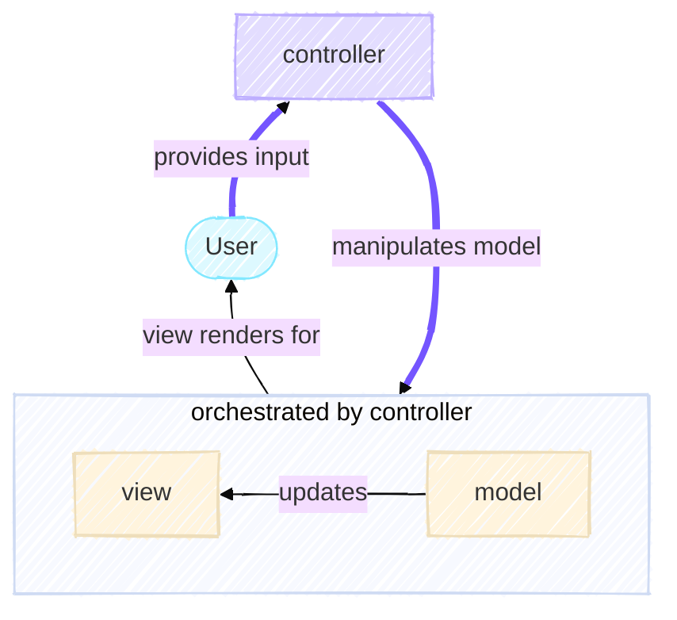
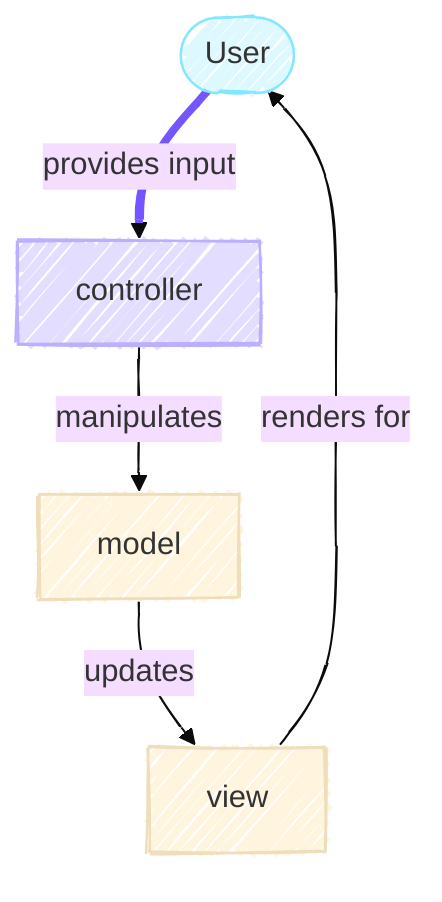

# The Controller

The Controller is the orchestrator of the MVC architecture. While the Model knows nothing about the user or the display, and the View knows nothing about the game rules, the Controller coordinates between them. It interprets user input, transforms it into commands for the Model, and ensures the View receives updated state at the right time.

In our Game of Life application, the Controller's responsibilities include:

- Creating and configuring the Model with the right initialization strategy
- Managing the simulation loop
- Coordinating between Model and View

In the diagram below, the user provides input through the configuration to the controller. This allows it to manipulated the model and configure it to have the right initialization strategy. It then orchestrates the the interactions between the view and the model by managing the simulation loop.



The MVC architecture enables the Controller logic remains simple and stable as long as the Model and View interfaces are well-defined.

## Configuration to Facilitate Dependency Injection

Before the Controller can orchestrate anything, it needs instructions. In well-designed research software, configuration should be explicit, validated, and separate from code. This is handled through configuration files and [`pydantic` models](https://pydantic.dev/docs/validation/latest/concepts/models/).



### From YAML to Typed Configuration

The journey begins with a YAML configuration file. But configuration files are just strings—they need to be validated and transformed into typed Python objects. This is where Pydantic comes in:

```python title="config.py"
class FromYaml(BaseModel):
    """Base class providing YAML loading functionality for configuration classes."""

    @classmethod
    def from_yaml(cls, path: "Path") -> Self:
        """Load configuration from a YAML file."""
        if not path.is_file():
            raise ValueError("Configuration file not found or is not a file.")

        with path.open(mode="r", encoding="utf-8") as f:
            data: dict[Hashable, Any] = yaml.safe_load(f)

        return cls.model_validate(data)
```

This pattern separates concerns: YAML loading logic lives in one place, and subclasses inherit this capability. When `cls.model_validate(data)` is called, Pydantic performs validation—checking types, enforcing constraints, and raising clear errors if something is wrong. This *fails fast*: invalid configurations are caught immediately, before any simulation begins.

### Enumerations for Type Safety

Configuration often involves selecting from a fixed set of options. Rather than using strings that can have typos or be misunderstood, we use enums:

```python title="config.py"
class GridInitialiser(StrEnum):
    """Enumeration of supported grid initialization strategies."""
    ZEROS = "zeros"
    RANDOM = "random"
    PATTERN = "pattern"

class DisplayInterface(StrEnum):
    """Enumeration of supported display/view interfaces."""
    CLI = "cli"
    PLOT = "plot"
```

When a Pydantic model field uses an enum, Pydantic automatically validates that the input matches one of the defined values. Typos in YAML configuration are caught and reported to the user. At the code level, you can exhaustively pattern-match on the enum (more on this below), and the type checker can verify you've handled all cases.

### Composition of Configuration Objects

Configuration objects themselves are composed into higher-level configurations:

```python title="config.py"
class GameOfLifeConfigFrom(FromYaml):
    """Configuration for Game of Life simulation parameters."""
    num_rows: PositiveInt = 50
    num_cols: PositiveInt = 50
    grid_initialiser: GridInitialiser = GridInitialiser.ZEROS
    density: Proportion | None = None
    pattern: Pattern | None = None

class RunConfig(FromYaml):
    """Top-level configuration combining game and view settings."""
    interface: DisplayInterface
    view_config: CLIViewConfig | PlotViewConfig
    gol_config: GameOfLifeConfigFrom
```

`RunConfig` composes both game configuration and view configuration. This reflects the composition pattern mentioned in the Model section: a `RunConfig` *has a* `GameOfLifeConfigFrom` (it is not one). By structuring configuration this way, we make the relationships between components explicit and testable.

## The Factory Pattern for Grid Creation

Looking back at the Model, we learned that `GameOfLife` accepts a `GridCreator` strategy. But which strategy should be used? That depends on user configuration. The `GridCreatorFactory` encapsulates this selection logic:

```python title="controller.py"
class GridCreatorFactory:
    """Factory for creating appropriate GridCreator instances based on configuration."""

    def __init__(self, input_config: GameOfLifeConfigFrom) -> None:
        self.input_config: GameOfLifeConfigFrom = input_config

    def create(self) -> GridCreator:
        """Create and return an appropriate GridCreator based on configuration."""
        match self.input_config.grid_initialiser:
            case GridInitialiser.ZEROS:
                return ZerosGridCreator()
            case GridInitialiser.RANDOM:
                if self.input_config.density is not None:
                    return RandomGridCreator(density=float(self.input_config.density))
                return RandomGridCreator()
            case GridInitialiser.PATTERN:
                if self.input_config.pattern is None:
                    raise ValueError("Pattern must be specified for pattern grid initialiser")
                target_pattern = self.input_config.pattern
                row_offset = self.approximate_offset_to_center(
                    self.input_config.num_rows, target_pattern.height
                )
                col_offset = self.approximate_offset_to_center(
                    self.input_config.num_cols, target_pattern.width
                )
                return PatternGridCreator(target_pattern, row_offset=row_offset, col_offset=col_offset)
            case _ as unreachable:
                assert_never(unreachable)
```

Notice the `match` statement. This is Python 3.10+ exhaustive pattern matching. Each `case` corresponds to an enum member. The type checker verifies that all cases are covered. The `assert_never()` acts as a safety net—if an unexpected value somehow reaches this code at runtime, it raises an error.

This design choice—using `match` on an enum—makes the code self-documenting: a reader immediately sees all possible initialization strategies. It's also maintainable: if you add a new `GridInitialiser` member, the type checker will alert you that the `match` statement is incomplete.

### Why a Factory?

Why not just instantiate grid creators directly? As configurations grow more complex, they often require intricate setup logic. The Factory Pattern centralizes this logic in one place. If you need to change how random grids are created, you modify only the Factory. If you add a new grid creation strategy, you add only a new case to the match statement. This is the **Single Responsibility Principle** in action: `GridCreatorFactory` has one job—decide which grid creator to instantiate based on configuration.

## The Iterator Pattern for Control

Once the Model is created, how does the Controller advance the simulation? It could write a simple loop, but a better approach is to abstract the iteration logic:

```python title="controller.py"
class GoLIterator:
    """Iterator for controlling Game of Life simulation iterations."""

    def __init__(self, max_iterations: int | None = None) -> None:
        self.max_iterations: int | None = max_iterations
        self.count: int = 0

    def __iter__(self) -> Self:
        return self

    def __next__(self) -> int:
        if self.max_iterations is not None and self.count >= self.max_iterations:
            raise StopIteration
        self.count += 1
        return self.count - 1
```

This implements Python's **Iterator Protocol**. By doing so, `GoLIterator` works seamlessly with Python's `for` loop. The iterator pattern decouples iteration logic from the code that uses it. Want to add a pause or checkpoint between iterations? Modify the iterator. Want to log each generation? Add it to `__next__`. The code using the iterator doesn't need to change.

## The Orchestration Loop

The Controller's main orchestration happens here:

```python title="controller.py"
def execute_game_of_life(
    game: GameOfLife,
    view: BaseView,
    num_generations: int | None,
) -> None:
    """Execute the Game of Life simulation for a specified number of generations."""
    with view as opened_view:
        for _ in GoLIterator(num_generations):
            opened_view.render(game)
            game.step()
```

This is elegant in its simplicity. The function receives already-constructed objects: a Model (game), a View, and a generation count. It doesn't create them—they're passed in. This is **Dependency Injection**: dependencies are provided rather than created internally, making the function easy to test and flexible to use.

The logic is straightforward:
1. Enter the View's context manager (resources are initialized)
2. For each generation:
   - Ask the View to render the current state
   - Tell the Model to step forward one generation
3. Exit the View's context manager (resources are cleaned up)

Notice what's *not* here: no game logic, no display code, no configuration parsing. The Controller orchestrates but doesn't implement. This separation is the power of MVC.

## Factory Pattern for Views

Just as the Model uses a factory to select grid creators, the Controller needs a factory to select views:

```python title="main.py"
def _create_view(run_config: RunConfig) -> BaseView:
    """Create the appropriate view based on configuration using the Factory Pattern."""
    match run_config.interface:
        case DisplayInterface.CLI:
            if not isinstance(run_config.view_config, CLIViewConfig):
                raise ValueError("View config must be of type CLIViewConfig for CLI interface")
            return CliView(run_config.view_config.speed)
        case DisplayInterface.PLOT:
            if not isinstance(run_config.view_config, PlotViewConfig):
                raise ValueError("View config must be of type PlotViewConfig for PLOT interface")
            return PlotView(output_path=run_config.view_config.output_dir / run_config.view_config.output_filename)
        case _ as unreachable:
            assert_never(unreachable)
```

Again, exhaustive pattern matching ensures all interface types are handled. The type guards (`isinstance` checks) provide runtime validation that the configuration matches the selected interface. This prevents subtle bugs where, for example, someone selects CLI interface but provides plot configuration.

## The Command-Line Interface

The Controller's role extends to the command-line interface, implemented in `main.py`. This is where Typer (a modern CLI framework) bridges user input to the Controller:

```python title="main.py"
@app.command()
def run(
    config: Annotated[Path, typer.Argument(exists=True, file_okay=True, dir_okay=False)],
    generations: Annotated[int | None, typer.Option(help="Number of generations", min=1)] = None,
) -> None:
    """Run the Game of Life with configuration from a YAML file."""
    run_config = RunConfig.from_yaml(config)

    if run_config.interface == DisplayInterface.PLOT and generations is None:
        raise ValueError("Generations must be provided for plot interface")

    view = _create_view(run_config)
    game = create_game_of_life(run_config.gol_config)
    execute_game_of_life(game, view, generations)
```

Observe the flow:
1. User provides a config file path
2. `RunConfig.from_yaml()` loads and validates the configuration
3. `_create_view()` instantiates the appropriate View (Factory Pattern)
4. `create_game_of_life()` instantiates the Model with the appropriate grid creator
5. `execute_game_of_life()` orchestrates the simulation

Each step transforms and passes data forward. There's minimal branching logic—decisions about which objects to create are delegated to factories. This makes the code readable and maintainable.

## Design Patterns Summary

Several patterns work together in the Controller:

**Factory Pattern**: `GridCreatorFactory` and `_create_view` encapsulate object creation, hiding complexity from callers.

**Iterator Pattern**: `GoLIterator` abstracts iteration over generations, making it easy to modify or extend iteration behavior.

**Dependency Injection**: Functions receive their dependencies (game, view, config) rather than creating them, enabling testability and flexibility.

**Enum Pattern**: Enumerations restrict configuration options to valid choices and enable exhaustive pattern matching.

**Composition Pattern**: Configuration objects are composed together, reflecting the structure of the system.

**Strategy Pattern**: By accepting a `BaseView` interface, the orchestration loop works with any view implementation without modification.

## The Power of Good Architecture

The Controller layer demonstrates why good architecture matters. The orchestration loop is just five lines of code. It's simple because the Model and View have clean interfaces, and because configuration is explicit and validated before it reaches the orchestration logic.

Compare this to what might happen without this architecture: mixed concerns, hard-coded configuration, tight coupling between components. Adding a new visualization mode would require modifying multiple files. Bugs would be hard to isolate because no clear boundary exists between simulation and display.

Instead, our architecture makes adding features straightforward—add a new Grid Creator? Update the factory. Add a new View? Implement BaseView and update the view factory. Add new configuration options? Extend the Pydantic model. Each change is localized and minimal.

This is the goal of the Controller layer: keep orchestration logic simple by making the pieces it orchestrates (Model and View) well-designed and isolated.
