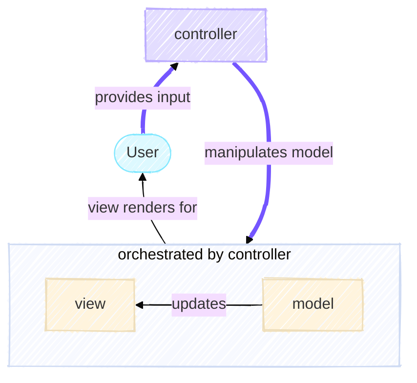
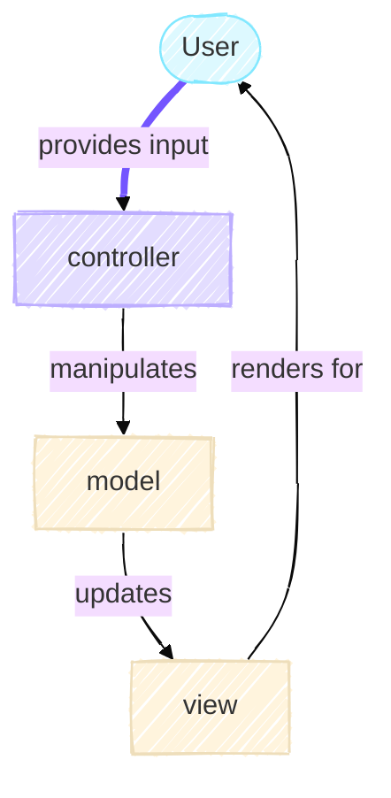

# The Controller

The Controller is the orchestrator of the MVC architecture. While the Model knows nothing about the user or the display, and the View knows nothing about the game rules, the Controller coordinates between them. It interprets user input, transforms it into commands for the Model, and ensures the View receives updated state at the right time.

In our Game of Life application, the Controller's responsibilities include:

- Creating and configuring the Model with the right initialization strategy
- Managing the simulation loop
- Coordinating between Model and View

In the diagram below, the user provides input through the configuration to the controller. This allows it to manipulated the model and configure it to have the right initialization strategy. It then orchestrates the the interactions between the view and the model by managing the simulation loop.



The MVC architecture enables the Controller logic to remain simple and stable as long as the Model and View interfaces are well-defined.

## Configuration to Facilitate Dependency Injection

Before the Controller can orchestrate anything, it needs instructions. In well-designed research software, configuration should be explicit, validated, and separate from code. This is handled through configuration files and [`pydantic` models](https://pydantic.dev/docs/validation/latest/concepts/models/).



### Deserialization: From Input File Format to Python Object

The journey begins with a YAML configuration file. But these configuration files are just text. They need to (magically) be validated and transformed into typed Python objects. This is where `pydantic` comes in,

```python title="config.py" linenums="1"
class FromYaml(BaseModel):
    """Base class providing YAML loading functionality for configuration classes."""

    @classmethod
    def from_yaml(cls, path: "Path") -> Self:
        """Load configuration from a YAML file."""
        if not path.is_file():
            raise ValueError("Configuration file not found or is not a file.")

        with path.open(mode="r", encoding="utf-8") as f:
            data: dict[Hashable, Any] = yaml.safe_load(f)

        # raises ValidationError if it fails
        return cls.model_validate(data)
```

This class inherits from the [`pydantic.BaseModel`](https://pydantic.dev/docs/validation/latest/concepts/models/#basic-model-usage) to provide it with all the validation functionalities of `pydantic`. The method shown here is a [class method](https://docs.python.org/3.14/library/functions.html#classmethod) as the class defines what validation is performed on the data.
When `cls.model_validate(data)` is called on line 14, `pydantic` performs validation by checking types, enforcing constraints, and raising clear errors if something is wrong. This *fails fast*, any invalid configurations are caught immediately, before the simulation begins.

!!! note

    By default, `pydantic` provides an [interface for deserialization of JSON files](https://pydantic.dev/docs/validation/latest/concepts/json/). However, I find JSON files unwieldy and less human readable. My personal preference for configuration files are [YAML files](https://yaml.org/).

### Using Enumerations for Input Validation

Configuration often involves selecting from a fixed set of options. Rather than using strings that can have typos or be misunderstood, we use enums,

```python title="config.py"
class GridInitialiser(StrEnum):
    ZEROS = "zeros"
    RANDOM = "random"
    PATTERN = "pattern"

class DisplayInterface(StrEnum):
    CLI = "cli"
    PLOT = "plot"
```

When a `pydantic` model field uses an enum, `pydantic` automatically validates that the input matches one of the defined values. Typos in YAML configuration are caught and reported to the user. At the code level, you can [exhaustively match patterns](https://realpython.com/structural-pattern-matching/) on the enum (more on this below), and the type checker can verify you've handled all cases. We talk about this more in [Turning Configurations into Objects](#turning-configurations-into-objects).

### Composition of Configuration Objects

Configuration objects themselves are composed into higher-level configurations. For example, to configure the full game of life simulation we have this class,

```python title="config.py"
Proportion = Annotated[NonNegativeFloat, Field(le=1)]

class GameOfLifeConfigFrom(FromYaml):
    """Configuration for Game of Life simulation parameters."""
    num_rows: Annotated[PositiveInt, Field(description="Number of rows in game of life grid")] = 50
    num_cols: Annotated[PositiveInt, Field(description="Number of cols in game of life grid")] = 50
    grid_initialiser: GridInitialiser = GridInitialiser.ZEROS
    density: Annotated[Proportion | None, Field(description="Density of cells in game of life grid")] = None
    pattern: Annotated[Pattern | None, Field(description="Pattern to initialise grid with")] = None
```

The syntax of the type annotation for the fields here is a little complicated. It follows [`pydantic`'s annotated pattern](https://pydantic.dev/docs/validation/latest/concepts/fields/#the-annotated-pattern) which allows us to specify a constrain and attach the [`Field()` function](https://pydantic.dev/docs/validation/latest/api/pydantic/fields/#pydantic.fields.Field) to provide additional information about a field. In this case, it provides a description of the field which would be useful for the user or a new developer.

1. The `num_rows` and `num_cols` fields of the class which are constrained to be a positive `int` through the [`pydantic` `PositiveInt` class](https://pydantic.dev/docs/validation/2.3/usage/types/number_types/#constrained-integers).
2. The `grid_initialiser` field uses the `GridInitialiser` enum thus the only valid values for this field will be `#!py "zeros", "random", "pattern"`
3. The `density` field uses the type alias of `Proportion`. This pattern is useful when a type will be reused in another case as it avoids code duplication.
4. The `pattern` field is the class [`Pattern` from our Model](https://github.com/ImperialCollegeLondon/ReCoDE-research-python-patterns/blob/c272ab0f50586085079b61d181ce8ecb37c451e9/src/game_of_life/model.py#L30-L90). If this is provided, it will perform the validations defined in that class. This is an example of how we can have [nested models](https://pydantic.dev/docs/validation/latest/concepts/models/#nested-models), i.e. a child class of `pydantic.BaseModel` can be composed of other children of `pydantic.BaseModel`.


```py
class RunConfig(FromYaml):
    """Top-level configuration combining game and view settings."""
    interface: DisplayInterface
    view_config: CLIViewConfig | PlotViewConfig
    gol_config: GameOfLifeConfigFrom
```

The `RunConfig` class enables a single configuration file to be provided to specify both the game and the view configurations.
<!--As mentioned in the [Model section](4-model#)-->
This reflects the composition pattern mentioned in the Model section: a `RunConfig` *has a* `GameOfLifeConfigFrom` (it is not one). By structuring configuration this way, we make the relationships between components explicit and testable.

## Turning Configurations into Objects

The controller's job is to take user input and manipulate the model accordingly. To kick off the simulation, the `GameOfLife` needs to be instantiated which requires the `GridCreator` class to be instantiated with the information from the user. As the controller sits between the user input and the model, it is responsible for injecting this information into the `GameOfLife`. This is a form of [dependency injection](https://en.wikipedia.org/wiki/Dependency_injection), specifically this is a form of [constructor dependency injection](https://en.wikipedia.org/wiki/Dependency_injection#Constructor_injection) as the instance of `GridCreator` is passed in as argument to the constructor of the `GameOfLife`.

!!! quote
    "As an analogy, cars can be thought of as services which perform the useful work of transporting people from one place to another. Car engines can require gas, diesel or electricity, but this detail is unimportant to the client (e.g. a passenger) who only cares if it can get them to their destination.

    Cars present a uniform interface through their pedals, steering wheels and other controls. As such, which engine they were 'injected' with on the factory line ceases to matter and drivers can switch between any kind of car as needed."

    [From Wikipedia](https://en.wikipedia.org/wiki/Dependency_injection#Analogy)

Due to the multiple permutations of the `GridCreator` and the complexity of instantiating each child class, we want to use a [creational design design pattern](https://en.wikipedia.org/wiki/Creational_pattern) - as we want to create an object - called a [factory](https://en.wikipedia.org/wiki/Factory_(object-oriented_programming)). The `GridCreatorFactory` encapsulates this selection logic,

```python title="controller.py"
class GridCreatorFactory:
    """Factory for creating appropriate GridCreator instances based on configuration."""

    def __init__(self, input_config: GameOfLifeConfigFrom) -> None:
        self.input_config: GameOfLifeConfigFrom = input_config

    def create(self) -> GridCreator:
        """Create and return an appropriate GridCreator based on configuration."""
        match self.input_config.grid_initialiser:
            case GridInitialiser.ZEROS:
                return ZerosGridCreator()
            case GridInitialiser.RANDOM:
                if self.input_config.density is not None:
                    return RandomGridCreator(density=float(self.input_config.density))
                return RandomGridCreator()
            case GridInitialiser.PATTERN:
                if self.input_config.pattern is None:
                    raise ValueError("Pattern must be specified for pattern grid initialiser")
                target_pattern = self.input_config.pattern
                row_offset = self.approximate_offset_to_center(
                    self.input_config.num_rows, target_pattern.height
                )
                col_offset = self.approximate_offset_to_center(
                    self.input_config.num_cols, target_pattern.width
                )
                return PatternGridCreator(target_pattern, row_offset=row_offset, col_offset=col_offset)
            case _ as unreachable:
                assert_never(unreachable)
```

Which child class is instantiated depends on the enum specified in the `GameOfLifeConfigFrom.grid_initialiser` field. As the initializer for each child class requires a unique logic, this branching has been achieved using [Python's `match` statement](https://docs.python.org/3/reference/compound_stmts.html#the-match-statement).
This is a Python 3.10+ feature which enables exhaustive pattern matching. Each `case` corresponds to an enum member. The type checker verifies that all cases are covered. The [`assert_never()`](https://typing.python.org/en/latest/guides/unreachable.html#assert-never-and-exhaustiveness-checking) acts as a safety net, if an unexpected value somehow reaches this code at runtime, it raises an error. It also allows for some code to be [marked as being unreachable to the static type checker](https://typing.python.org/en/latest/guides/unreachable.html#marking-code-as-unreachable).

By using `match` on an enum, it makes the code self-documenting and maintainable. A reader would immediately see all possible initialization strategies. If you add a new `GridInitialiser` member, the type checker will alert you that the `match` statement is incomplete.

### Why a Factory?

Why not just instantiate grid creators directly? As configurations grow more complex, they often require intricate setup logic. The Factory Pattern centralizes this logic in one place. If you need to change how random grids are created, you modify only the Factory. If you add a new grid creation strategy, you add only a new case to the match statement. This is the application of the single responsibility principle, `GridCreatorFactory` has one job: decide which grid creator to instantiate based on configuration. This allows the [`create_game_of_life()` method](https://github.com/ImperialCollegeLondon/ReCoDE-research-python-patterns/blob/c272ab0f50586085079b61d181ce8ecb37c451e9/src/game_of_life/controller.py#L167-L194) which is responsible for instantiating the `GameOfLife` to be extremely simple and only be responsible for that.

## Orchestrating the Model and the View

The controller is responsible for updating the model such that the view updates accordingly. Thus, it specifies how the two should interact with each other.

### The Iterator Pattern for Control

Once the Model is created, how does the Controller advance the simulation? It could be a simple loop, but a better approach is to abstract the iteration logic,

```python title="controller.py"
class GoLIterator:
    """Iterator for controlling Game of Life simulation iterations."""

    def __init__(self, max_iterations: int | None = None) -> None:
        self.max_iterations: int | None = max_iterations
        self.count: int = 0

    def __iter__(self) -> Self:
        return self

    def __next__(self) -> int:
        if self.max_iterations is not None and self.count >= self.max_iterations:
            raise StopIteration
        self.count += 1
        return self.count - 1
```

The main driver behind this abstraction is our requirement to have the CLI interface to run indefinitely while requiring a maximum number of iterations for the plotting view. This could be avoided by restricting the functionality to be such that a maximum number of iterations must be specified for the CLI interface. This additional complexity was chosen to be able to introduce the [iterator pattern](https://en.wikipedia.org/wiki/Iterator_pattern). Otherwise, one should apply the [KISS principle - "keep it simple, stupid"](https://en.wikipedia.org/wiki/KISS_principle)

This implements Python's **Iterator Protocol**. By doing so, `GoLIterator` works seamlessly with Python's `for` loop. The iterator pattern decouples iteration logic from the code that uses it. Want to add a pause or checkpoint between iterations? Modify the iterator. Want to log each generation? Add it to `__next__`. The code using the iterator doesn't need to change.

### The Orchestration Loop

The Controller's main orchestration happens here,

```python title="controller.py"
def execute_game_of_life(
    game: GameOfLife,
    view: BaseView,
    num_generations: int | None,
) -> None:
    with view as opened_view:
        for _ in GoLIterator(num_generations):
            opened_view.render(game)
            game.step()
```

This is elegant in its simplicity. The function receives already-constructed objects: a Model (i.e. `GameOfLife` instance), a View, and a maximum generation count. It doesn't create them, they're passed in.
By using dependency injection - where dependencies are provided rather than created internally - it makes the function easy to test and flexible to use.

The logic is straightforward,
1. Enter the View's context manager (resources are initialized)
2. For each generation:
   - Ask the View to render the current state
   - Tell the Model to step forward one generation
3. Exit the View's context manager (resources are cleaned up)

Notice what's *not* here: there is no game logic, no display code, no configuration parsing. The Controller orchestrates but doesn't implement. This separation is the power of MVC.

## Bringing it All Together

### Design Patterns Summary

Several patterns work together in the Controller,

- **Factory Pattern**: `GridCreatorFactory` encapsulate object creation, hiding complexity from callers.
- **Iterator Pattern**: `GoLIterator` abstracts iteration over generations, making it easy to modify or extend iteration behavior.
- **Dependency Injection**: Functions receive their dependencies (game, view, config) rather than creating them, enabling testability and flexibility.
- **Enum Pattern**: Enumerations restrict configuration options to valid choices and enable exhaustive pattern matching.
- **Composition Pattern**: Configuration objects are composed together, reflecting the structure of the system.
- **Strategy Pattern**: By accepting a `BaseView` interface, the orchestration loop works with any view implementation without modification.

### The Power of Good Architecture

The Controller layer demonstrates why good architecture matters. The orchestration loop is just five lines of code. It's simple because the Model and View have clean interfaces, and because configuration is explicit and validated before it reaches the orchestration logic.

Compare this to what might happen without this architecture: for example, mixing concerns, hard-coded configuration and tight coupling between components. Adding a new visualization mode would require modifying multiple files. Bugs would be hard to isolate because no clear boundary exists between simulation and display.

Instead, our architecture makes adding features straightforward. To add a new `GridCreator`? Update the factory. Add a new View? Implement `BaseView` and update the view factory. Add new configuration options? Extend the `pydantic` model. Each change is localized and minimal.

The goal of the controller layer is to keep orchestration logic simple by making the pieces it orchestrates (Model and View) well-designed and isolated.
